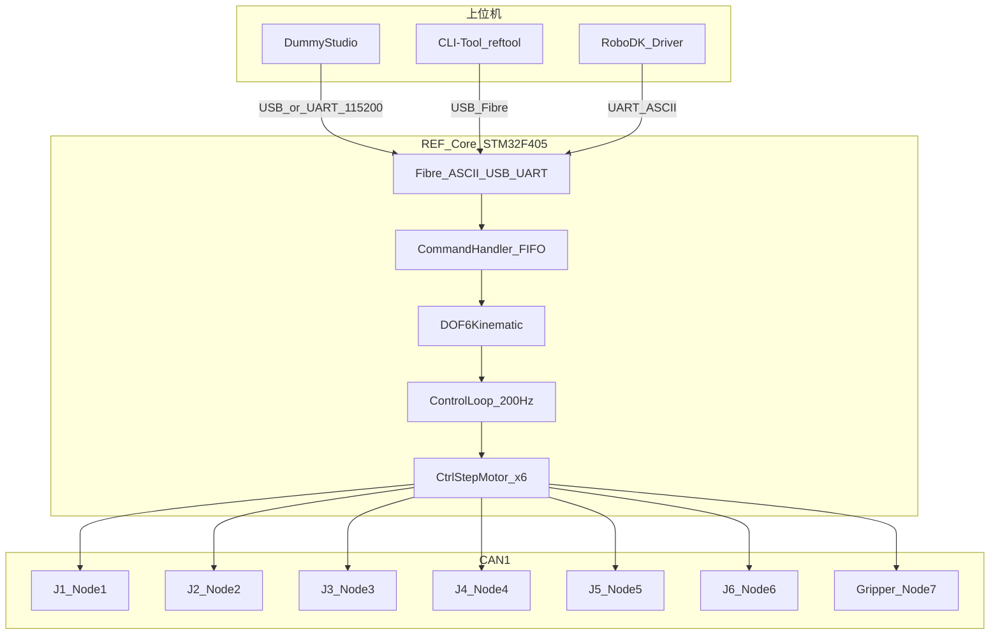
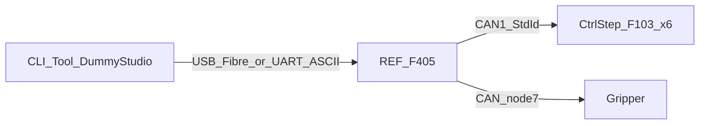
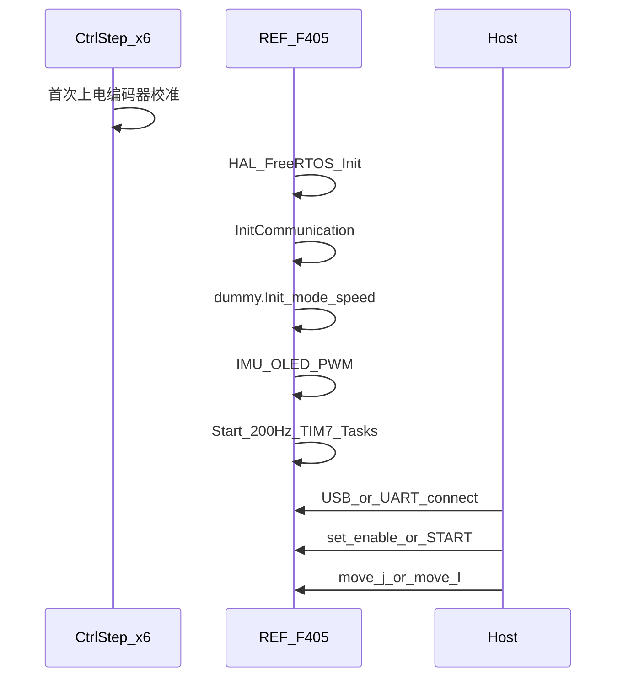

# Dummy-Robot 软硬件架构文档

> 面向二次开发的系统架构说明。参数与协议以当前仓库源码为准。  
> 官方仓库：[peng-zhihui/Dummy-Robot](https://github.com/peng-zhihui/Dummy-Robot)  
> 本地上手指南：[PROJECT_GUIDE_CN.md](../PROJECT_GUIDE_CN.md)  
> **网络架构入门**（小白向：分层理论、UART/USB/CAN/ASCII/Fibre、整机走读）：[`NETWORK_ARCHITECTURE_LEARNING_CN.md`](NETWORK_ARCHITECTURE_LEARNING_CN.md)  
> **模块详细设计**（各代码模块设计架构与功能）：[`design/README.md`](design/README.md)

---

## 1. 系统总览

Dummy-Robot 是一套**超迷你工业风格六轴机械臂**开源方案：关节采用步进电机 + 减速器，驱动侧做闭环控制；核心控制器完成运动学与轨迹规划；上位机经 USB/串口下发指令。

### 1.1 角色分工

| 角色 | 硬件 / 软件 | MCU / 平台 | 职责 |
|------|-------------|------------|------|
| 上位机 | DummyStudio、CLI-Tool、RoboDK 驱动 | PC（Windows） | 示教、调试、轨迹下发 |
| REF 核心 | REF-Unit + REF-Base | **STM32F405RG** | 运动学、指令队列、200Hz 控制环、PC 通信 |
| 关节驱动 ×6 | MotorDriver-42/20 | **STM32F103CB** | 20kHz 闭环步进、编码器、CAN/UART 从站 |
| 夹爪 | HandModule | CAN Node **7** | 开合角度 / 电流限幅 |
| Peak（可选） | `0.SubModules/Peak` | 独立 MCU | 无线示教（Git Submodule） |
| Dangle（可选） | `1.Hardware/Dangle` | 独立 PCB | 无线空间定位输入 |

### 1.2 总体架构



**设计要点**：关节驱动通过 CAN **串联**，整臂只需 **4 根线**（电源正负 + CANH/CANL），可工作在力矩 / 速度 / 位置等模式；避免传统脉冲式每个关节单独拉 step/dir 线的布线问题。

---

## 2. 硬件架构

### 2.1 板卡拓扑

电路实现主控与驱动的核心板卡如下（Altium Designer 工程位于 [`1.Hardware/`](../1.Hardware/)）：

| 板卡 | 路径 | 说明 |
|------|------|------|
| REF 多板工程 | `1.Hardware/REF/REF.PrjMbd` | Unit（核心板）+ Base（底座控制板） |
| 42 步进驱动 | `1.Hardware/MotorDriver-42/` | 本项目主用规格，含 Gerber |
| 20 步进驱动 | `1.Hardware/MotorDriver-20/` | 小规格关节扩展 |
| 57 步进（参考） | `1.Hardware/MotorDriver-57-unused/` | 标注 unused，供扩展 |
| 夹爪 | `1.Hardware/HandModule/` | 末端执行器 |
| LED 灯环 | `1.Hardware/LedRing/` | 状态指示 |
| Dangle | `1.Hardware/Dangle/` | 无线空间定位控制器 |
| Controller | `1.Hardware/Controller/` | 相关控制器 PCB |

> 仓库内**无独立 BOM CSV / 原理图 PDF**，需用 Altium 打开工程导出。步进驱动设计参考 [XDrive](https://github.com/unlir/XDrive)，本项目在此基础上重构并增加 CAN。

### 2.2 物理连接

```text
电源正极 ──┬── J1 ── J2 ── J3 ── J4 ── J5 ── J6 ── Hand
电源负极 ──┤
CANH     ──┤   （标准 CAN 总线串联）
CANL     ──┘
```

- REF 固件中电机协议挂在 **CAN1**（`DummyRobot` 构造时绑定 `&hcan1`）；CAN2 已初始化，协议回调预留扩展。
- 每个驱动器接收两类 ID：**本机 NodeID** 与 **广播 NodeID=0**。

### 2.3 关节与减速参数

来源：[`dummy_robot.cpp`](../2.Firmware/Core-STM32F4-fw/Robot/instances/dummy_robot.cpp) 构造函数。

| 关节 | CAN NodeID | 反向 | 减速比 | 角度限位 (°) |
|------|------------|------|--------|--------------|
| ALL（广播） | 0 | 否 | 1 | -180 ~ 180 |
| J1 | 1 | 是 | 50 | -170 ~ 170 |
| J2 | 2 | 否 | 30 | -73 ~ 90 |
| J3 | 3 | 是 | 30 | 35 ~ 180 |
| J4 | 4 | 否 | 24 | -180 ~ 180 |
| J5 | 5 | 是 | 30 | -120 ~ 120 |
| J6 | 6 | 是 | 50 | -720 ~ 720 |
| Hand | 7 | — | — | 0 ~ 45 |

默认关节速度：`DEFAULT_JOINT_SPEED = 30 °/s`；默认指令模式：**INT**（可打断实时指令）。

### 2.4 DH 参数与运动学构型

`DOF6Kinematic` 构造参数（单位：**米**）：

| 符号（代码实参顺序） | 数值 | 含义（见配图） |
|----------------------|------|----------------|
| L_BS / BASE | 0.109 | 底座高度相关 |
| D_BS | 0.035 | 底座偏置 |
| L_AM / ARM | 0.146 | 大臂长 |
| L_FA / FOREARM | 0.115 | 小臂长 |
| D_EW | 0.052 | 肘部偏置 |
| L_WT / WRIST | 0.072 | 腕部到工具 |

配图：[`5.Docs/1.Images/fw2.jpg`](1.Images/fw2.jpg)、关节配置截图 [`fw1.jpg`](1.Images/fw1.jpg)。

构型需满足 **Pieper 判据**（相邻三轴交于一点或三轴线平行）才能得到解析逆解。更换机械结构时，主要修改 DH 与关节限位/减速比即可迁移固件。

**上电零点**：驱动侧为单圈绝对值磁编码器。上电后用电流环做低力矩寻零，碰机械限位得粗零点，再按单圈绝对位置精调；在约 `360°/减速比` 范围内保持绝对值有效精度（见官方 README）。

### 2.5 机械模型

| 文件 | 说明 |
|------|------|
| `4.Model/Dummy v164.step` | 整机总成 |
| `4.Model/Case v17.step` | 手提箱 / 机箱 |
| `4.Model/Motor42-上盖.step` / `Motor42-下盖.step` | 42 电机壳体 |

低成本青春版规划：3D 打印 + [CycloidAcuratorNano](https://github.com/peng-zhihui/CycloidAcuratorNano) 摆线减速，软件与原版通用。

---

## 3. 软件 / 固件分层

### 3.1 仓库软件地图

```text
Dummy-Robot/
├── 1.Hardware/                         # Altium PCB
├── 2.Firmware/
│   ├── Core-STM32F4-fw/                # REF 核心固件
│   ├── Ctrl-Step-Driver-STM32F1-fw/    # 关节驱动固件
│   └── _Released HEX/                  # 预编译（当前多为 F1 hex）
├── 3.Software/
│   ├── CLI-Tool/                       # Python fibre / reftool
│   └── DummyStudio/                    # Unity 预编译上位机
├── 4.Model/                            # STEP
└── 5.Docs/
    ├── NETWORK_ARCHITECTURE_LEARNING_CN.md  # 网络/协议入门（小白向）
    ├── ARCHITECTURE_CN.md              # 本文件（系统总览）
    └── design/                         # 模块详细设计
```

### 3.1.1 模块详细设计索引

系统级说明见本文；**模块级入口、类职责、二次开发点**见 [`design/`](design/README.md)：

| 模块文档 | 代码路径 |
|----------|----------|
| [REF-App](design/REF-App.md) | `Core-STM32F4-fw/UserApp/` |
| [REF-Robot](design/REF-Robot.md) | `Core-STM32F4-fw/Robot/` |
| [REF-Comm](design/REF-Comm.md) | `Core-STM32F4-fw/Bsp/communication/` |
| [REF-Protocols](design/REF-Protocols.md) | `Core-STM32F4-fw/UserApp/protocols/` |
| [REF-BSP](design/REF-BSP.md) | `Core-STM32F4-fw/Bsp/{imu,gpio,memory,utils}/` |
| [REF-3rdParty](design/REF-3rdParty.md) | `Core-STM32F4-fw/3rdParty/` |
| [DRV-App](design/DRV-App.md) | `Ctrl-Step-.../UserApp/` |
| [DRV-Control](design/DRV-Control.md) | `Ctrl-Step-.../Ctrl/` |
| [DRV-Port](design/DRV-Port.md) | `Ctrl-Step-.../Port/` |
| [DRV-Protocols](design/DRV-Protocols.md) | `Ctrl-Step-.../UserApp/protocols/` |
| [HOST-CLI-Tool](design/HOST-CLI-Tool.md) | `3.Software/CLI-Tool/` |
| [HOST-DummyStudio](design/HOST-DummyStudio.md) | `3.Software/DummyStudio/` |

### 3.2 REF 核心固件（STM32F405 + FreeRTOS）

路径：[`2.Firmware/Core-STM32F4-fw/`](../2.Firmware/Core-STM32F4-fw/)

| 分层 | 目录 | 职责 | 详细设计 |
|------|------|------|----------|
| 应用 | `UserApp/` | `main.cpp` 任务创建；ASCII / Fibre / CAN 协议扩展（二次开发重点） | [REF-App](design/REF-App.md) · [REF-Protocols](design/REF-Protocols.md) |
| 机器人 | `Robot/` | `DummyRobot`、`DOF6Kinematic`、`CtrlStepMotor`、`DummyHand` | [REF-Robot](design/REF-Robot.md) |
| 板级 | `Bsp/` | USB/UART/CAN 通信、OLED、MPU6050、GPIO、软 I2C、EEPROM | [REF-Comm](design/REF-Comm.md) · [REF-BSP](design/REF-BSP.md) |
| 第三方 | `3rdParty/` | **fibre**（对象序列化）、**u8g2**（OLED） | [REF-3rdParty](design/REF-3rdParty.md) |
| 中间件 | `Middlewares/` | FreeRTOS（CMSIS-RTOS v2）、USB Device | — |
| Cube/HAL | `Core/`、`Drivers/`、`USB_DEVICE/` | 外设初始化与 ST HAL | — |

**入口链路**：

```text
Core/Src/main.c
  → FreeRTOS 启动
  → freertos.c: StartDefaultTask
  → UserApp/main.cpp: Main()
       → InitCommunication()
       → dummy.Init()
       → 创建控制环 / 指令解析 / OLED 线程
       → TIM7 @ 200Hz 唤醒实时控制任务
```

**关键类**：

- `DummyRobot`：整机对象，持有 `motorJ[0..6]`、`hand`、`dof6Solver`、`commandHandler`、`tuningHelper`
- `DOF6Kinematic`：传统 DH 正解 / 逆解（最多 8 组 IK，选相对当前姿态**最大关节变化量最小**的一组）
- `CtrlStepMotor`：单关节 CAN 封装（角度、减速比、限位、反向）
- `DummyHand`：夹爪 CAN 节点 7
- `CommandHandler`：深度 16 的指令 FIFO，解析 ASCII 运动指令

**遗留说明**：`UserApp/common_inc.h` 仍 `#include "actuators/mintasca/sca.hpp"`，指向早期 INNFOS SCA 执行器接口；当前主路径为 `Robot/actuators/ctrl_step/`。若 `mintasca` 目录缺失会导致编译失败，二次开发需移除该 include 或补回源码。

### 3.3 Ctrl-Step 驱动固件（STM32F103）

路径：[`2.Firmware/Ctrl-Step-Driver-STM32F1-fw/`](../2.Firmware/Ctrl-Step-Driver-STM32F1-fw/)  
详细设计：[DRV-App](design/DRV-App.md) · [DRV-Control](design/DRV-Control.md) · [DRV-Port](design/DRV-Port.md) · [DRV-Protocols](design/DRV-Protocols.md)

```text
Ctrl-Step-Driver-STM32F1-fw/
├── Ctrl/               # → DRV-Control.md
│   ├── Motor/          # motor、motion_planner
│   ├── Driver/         # TB67H450 斩波驱动
│   ├── Sensor/Encoder/ # MT6816 磁编码器、校准器
│   └── Signal/         # 按键、LED
├── Port/               # → DRV-Port.md（平台移植、模拟 EEPROM）
└── UserApp/            # → DRV-App.md / DRV-Protocols.md
```

**控制链**：

```text
CAN/UART 指令
  → 设定电流 / 速度 / 位置目标
  → MotionPlanner（梯形加减速）
  → Controller（DCE：Kp/Kv/Ki/Kd）
  → TB67H450 输出
  ← MT6816 编码器反馈
```

**定时器**：

| 定时器 | 频率 | 职责 |
|--------|------|------|
| TIM4 | **20 kHz** | `motor.Tick20kHz()` / 编码器校准 Tick |
| TIM1 | **100 Hz** | 按键、LED |

参数（节点 ID、电流/速度限、加速度、Home、DCE PID、堵转保护等）可写入**模拟 EEPROM**，掉电保存。首次上电自动编码器校准；双键上电可重新校准。按键行为见官方 README / [`fw3.png`](1.Images/fw3.png)。

NodeID 可在固件中按 MCU 序列号预设 J1~J6，也可由 CAN `0x11` 写入 EEPROM 覆盖。

---

## 4. 通信架构与协议

### 4.1 链路总览



| 链路 | 物理接口 | 协议 | 用途 |
|------|----------|------|------|
| PC ↔ REF | USB OTG FS | Fibre 二进制 + CDC ASCII | CLI-Tool 主用 Fibre；printf/调试走 CDC |
| PC ↔ REF | UART4（DMA 环缓） | ASCII / Fibre | DummyStudio、串口调试，典型 **115200** |
| PC ↔ REF | UART5 | 预留 | `OnUart5AsciiCmd` 为空 |
| REF ↔ 关节 | CAN1 | 自定义标准帧 | 位置/使能/参数/反馈 |
| 单驱动调试 | UART | 文本 `c/v/p` | 不经过 REF |

USB 设备描述：VID **`0x1209`**，PID **`0x0D32`**（及相关 `0x0D31/0x0D33`）。DummyStudio 配置见 `3.Software/DummyStudio/.../serial_config.txt`。

### 4.2 PC ↔ REF：Fibre 对象树

实现：固件 `3rdParty/fibre` + [`cmd_protocol.cpp`](../2.Firmware/Core-STM32F4-fw/UserApp/protocols/cmd_protocol.cpp)；PC 端 [`3.Software/CLI-Tool/fibre/`](../3.Software/CLI-Tool/fibre/)。

根对象示例字段：

- `serial_number`、`get_temperature`
- `robot.*`（见下表）

`robot` 主要 API（[`dummy_robot.h`](../2.Firmware/Core-STM32F4-fw/Robot/instances/dummy_robot.h)）：

| API | 说明 |
|-----|------|
| `move_j(j1..j6)` | 关节空间运动 |
| `move_l(x,y,z,a,b,c)` | 笛卡尔运动（内部 IK） |
| `set_enable` / `reboot` | 整机使能 / 重启 |
| `homing` / `resting` / `calibrate_home_offset` | 回零相关 |
| `set_joint_speed` / `set_joint_acc` | 速度与加速度 |
| `set_command_mode` | SEQ/INT/TRJ/TUN |
| `joint_1` … `joint_6` / `joint_all` | 单关节或广播调参 |
| `hand` | `set_angle` / `set_enable` / `set_current_limit` |
| `tuning` | 正弦扫频调试 |

CLI 连接后通常以 `odrv0.robot...` 形式访问（沿用 ODrive/fibre 工具习惯）。

### 4.3 PC ↔ REF：ASCII 协议

实现：[`ascii_protocol.cpp`](../2.Firmware/Core-STM32F4-fw/UserApp/protocols/ascii_protocol.cpp)

| 前缀 | 示例 | 行为 |
|------|------|------|
| `!` | `!STOP` / `!START` / `!DISABLE` | 急停、使能启动、失能 |
| `#` | `#GETJPOS` | 读 6 关节角 |
| `#` | `#GETLPOS` | 读末端位姿 XYZABC（mm / °） |
| `#` | `#CMDMODE 2` | 设置指令模式 |
| `>` | `>j1,j2,j3,j4,j5,j6[,speed]` | MoveJ，入队 |
| `@` | `@x,y,z,a,b,c[,speed]` | MoveL，入队 |

典型应答：`ok`、`ok v1 v2 ...`、`Started ok` 等。运动指令进入 `CommandHandler` 队列；队列深度可返回给上位机。

### 4.4 REF ↔ 关节：CAN 帧格式

```text
StdId = (nodeID << 7) | cmd
  - 高位字段：节点 ID（0=广播，1~6=关节，7=夹爪）
  - 低 7 bit：命令码
```

驱动端过滤：本机 `canNodeId` 或 `id==0` 时接收。

#### 命令码表（F4 `ctrl_step.cpp` ↔ F1 `interface_can.cpp`）

| cmd | 方向 | 功能 | 数据要点 |
|-----|------|------|----------|
| 0x01 | → | 使能 / 失能 | uint32 0/1 |
| 0x02 | → | 编码器校准 | — |
| 0x03 | → | 电流设定 | float (A) |
| 0x04 | → | 速度设定 | float (r/s) |
| 0x05 | → | 位置设定 | float 圈数；可要求 ACK |
| 0x06 | → | 带时间位置 | float pos + float time |
| 0x07 | → | 限速位置 | float pos + float vel（REF MoveJoints 主用） |
| 0x11 | → | 设置 NodeID 并存 EEPROM | |
| 0x12 | → | 电流限 + EEPROM | |
| 0x13 | → | 速度限 + EEPROM | |
| 0x14 | → | 加速度（可存 EEPROM） | |
| 0x15 | → | Apply Home + EEPROM | |
| 0x16 | → | 上电自动使能 | |
| 0x17~0x1A | → | DCE Kp/Kv/Ki/Kd | |
| 0x1B | → | 堵转保护使能 | |
| 0x21 | ← | 读电流 | float |
| 0x22 | ← | 读速度 | float |
| 0x23 | ← | 读位置 / 到位 ACK | float + 完成标志 |
| 0x24 | ← | 读 Offset | float |
| 0x7e | → | 擦除配置 | |
| 0x7f | → | 重启 | |

**反馈路径**：驱动回传 `0x23` → REF `can_protocol.cpp` → `CtrlStepMotor::UpdateAngleCallback` → `UpdateJointAnglesCallback`，置位 `jointsStateFlag` 对应关节位，OLED 以 `*` / `_` 显示到位状态。

**夹爪（Node 7）**：角度设定、电流限幅（间接使能），见 `DummyHand`。

**单电机 UART 调试**（F1）：`c <float>` 电流、`v <float>` 速度、`p <float>` 位置。

### 4.5 指令模式

| 模式 | 枚举值 | 发送特征 | 执行方式 | 可打断 | 停顿 | 典型场景 |
|------|--------|----------|----------|--------|------|----------|
| SEQ | 1 | 低频随机 | FIFO 顺序 | 否 | 关键点间有 | 视觉抓取、码垛 |
| INT | 2（默认） | 频率不限 | 新指令覆盖 | 是 | 无 | 实时同步控制 |
| TRJ | 3 | 固定约 200Hz | 轨迹跟踪（完善中） | 否 | 无 | 3D 打印、雕刻 |
| TUN | 4 | — | `tuningHelper` 扫频 | — | — | 电机调试 |

---

## 5. 工作流程与控制时序

### 5.1 上电与初始化



1. 各关节驱动上电：校准成功后，短按键 1 进入闭环（或协议使能）。
2. REF：`InitCommunication()` 拉起 Fibre/USB/UART/CAN 服务任务。
3. `dummy.Init()` 设置默认 INT 模式与关节速度。
4. IMU（MPU6050）、OLED（软件 I2C + U8G2）、PWM 指示灯初始化。
5. 创建三用户线程 + TIM7 200Hz。

### 5.2 REF FreeRTOS 任务

| 任务 / 定时器 | 优先级 | 触发 | 职责 |
|---------------|--------|------|------|
| `commTask` 等通信任务 | Normal 等 | 常驻 | Fibre 发布、USB/UART/CAN 服务 |
| `usbIrqTask` | AboveNormal | 事件 | USB 中断延迟处理 |
| `ControlLoopFixUpdateTask` | **Realtime** | TIM7 **200Hz** Notify | 下发关节目标 / 更新位姿 |
| `ControlLoopUpdateTask` | Normal | 阻塞 Pop 队列 | 解析 ASCII 运动指令 |
| `OledTask` | Normal | 循环 | 显示 IMU、关节角、末端位姿、模式与到位标志 |

TIM7 回调仅 `vTaskNotifyGiveFromISR`，实际控制在 Realtime 任务中执行，避免在 ISR 中做重逻辑。

### 5.3 MoveJ / MoveL 流程

**MoveJ**（关节空间）：

1. 校验目标角是否在各轴限位内。
2. 计算与当前角的差分；取**最大差分角**对应关节，结合其减速比与 `jointSpeed` 估运动时间。
3. 为其余关节分配动态限速 `dynamicJointSpeeds`（换算到约 0~10 r/s 量级）。
4. 清 `jointsStateFlag`，写入 `targetJoints`。
5. 200Hz 环调用 `MoveJoints()` → 各轴 `SetAngleWithVelocityLimit`（CAN **0x07**）。
6. 各驱动到位回 ACK；标志齐全后可认为点到点完成（SEQ 模式下再取下一条队列指令）。

**MoveL**（笛卡尔）：

1. `SolveIK` 得到最多 8 组解。
2. 丢弃超限位解；在合法解中选相对当前姿态**最大关节变化量最小**的一组。
3. 转入与 MoveJ 相同的同步运动下发路径。

### 5.4 驱动侧 20kHz 环

```text
TIM4 @ 20kHz
  → encoderCalibrator.Tick20kHz() 或 motor.Tick20kHz()
       → 读 MT6816
       → DCE 控制律
       → TB67H450 斩波输出
```

上层 CAN 只更新设定点与参数；高频闭环全部在关节 MCU 本地完成，减轻 REF 总线负担并保证同步性。

### 5.5 同步策略说明

官方设计意图：各电机缓存指令，经 **Node0 广播** 进一步同步。当前实现中，REF 以 **200Hz 统一向 J1~J6 下发限速位置**，并用 Node0 做全体使能/重启/读角/设 Home 等广播；到位依赖 `0x23` ACK 聚合。若需严格“影子寄存器 + 同步脉冲”语义，可在二次开发中加强广播相位。

---

## 6. 上位机与工具链

### 6.1 CLI-Tool（reftool）

路径：[`3.Software/CLI-Tool/`](../3.Software/CLI-Tool/) · 详细设计：[HOST-CLI-Tool.md](design/HOST-CLI-Tool.md)

- 基于 ODrive `odrivetool` / fibre 框架的 Python 交互壳（`run_shell.py` / `run.bat`）。
- 默认 `--path usb`，也可 `serial:COMx`。
- 连接后操作 `robot.move_j`、`robot.joint_1.set_position` 等。
- 示例：`3.Software/CLI-Tool/_addition/ref_demo.py`。

### 6.2 DummyStudio

路径：[`3.Software/DummyStudio/`](../3.Software/DummyStudio/) · 详细设计：[HOST-DummyStudio.md](design/HOST-DummyStudio.md)

- Unity 预编译上位机（源码未开源），类似轻量 RoboDK。
- 串口配置：`VendorID=1209`，`BaudRate=115200`。
- 本快照若缺 `.exe`，需从官方 Release 补全。

### 6.3 RoboDK / Peak

| 组件 | 状态 | 说明 |
|------|------|------|
| RoboDK Driver | 视频中开发，仓库无源码 | 官方 TCP 驱动改为串口并兼容 Dummy ASCII |
| Peak 示教器 | Submodule，ZIP 快照常为空 | https://github.com/peng-zhihui/Peak ，基于 X-Track |
| ROS | 无节点源码 | 仅可能有 IDE 配置残留 |

### 6.4 本快照常见缺口

1. `0.SubModules/Peak` 未 `git submodule update --init`
2. `_Released HEX` 可能仅有 F1，F4 需本地编译
3. 无独立 BOM / 原理图 PDF / `ascii-protocol.md`
4. `mintasca` include 与目录可能不一致，影响 Core 工程编译

---

## 7. 二次开发地图

更细的模块入口与约束见 [`design/README.md`](design/README.md)。

| 目标 | 优先修改路径 | 详细设计 |
|------|----------------|----------|
| DH / 关节限位 / 减速比 / 反向 | `Robot/instances/dummy_robot.cpp`、`.h` | [REF-Robot](design/REF-Robot.md) |
| 正逆解算法 | `Robot/algorithms/kinematic/6dof_kinematic.*` | [REF-Robot](design/REF-Robot.md) |
| ASCII 命令 | `UserApp/protocols/ascii_protocol.cpp` | [REF-Protocols](design/REF-Protocols.md) |
| Fibre 对外 API | `UserApp/protocols/cmd_protocol.cpp`、`dummy_robot.h` 中 `MakeProtocolDefinitions` | [REF-Protocols](design/REF-Protocols.md) |
| REF→电机 CAN 封装 | `Robot/actuators/ctrl_step/ctrl_step.*` | [REF-Robot](design/REF-Robot.md) |
| 电机端 CAN/UART | `Ctrl-Step-.../UserApp/protocols/interface_can.cpp`、`interface_uart.cpp` | [DRV-Protocols](design/DRV-Protocols.md) |
| 控制环频率 / 任务 | `UserApp/main.cpp`（TIM7 200Hz） | [REF-App](design/REF-App.md) |
| 板载外设 | `Bsp/` | [REF-BSP](design/REF-BSP.md) · [REF-Comm](design/REF-Comm.md) |
| 驱动控制律 / 规划 | `Ctrl-Step-.../Ctrl/` | [DRV-Control](design/DRV-Control.md) |

**建议工具链**：CLion 或 STM32CubeIDE + CMake；烧录 ST-Link + STM32CubeProgrammer。

---

## 8. 附录

### 8.1 关键文件索引

| 文件 | 说明 |
|------|------|
| `2.Firmware/Core-STM32F4-fw/UserApp/main.cpp` | 任务与 200Hz 环 |
| `2.Firmware/Core-STM32F4-fw/Robot/instances/dummy_robot.*` | 整机模型与规划 |
| `2.Firmware/Core-STM32F4-fw/UserApp/protocols/ascii_protocol.cpp` | ASCII |
| `2.Firmware/Core-STM32F4-fw/UserApp/protocols/cmd_protocol.cpp` | Fibre 根对象 |
| `2.Firmware/Core-STM32F4-fw/UserApp/protocols/can_protocol.cpp` | CAN 反馈分发 |
| `2.Firmware/Core-STM32F4-fw/Robot/actuators/ctrl_step/ctrl_step.cpp` | CAN 命令发送 |
| `2.Firmware/Ctrl-Step-Driver-STM32F1-fw/UserApp/protocols/interface_can.cpp` | CAN 命令接收 |
| `2.Firmware/Ctrl-Step-Driver-STM32F1-fw/UserApp/main.cpp` | 20kHz / 100Hz |
| `3.Software/CLI-Tool/` | PC fibre 工具 |
| `5.Docs/NETWORK_ARCHITECTURE_LEARNING_CN.md` | 网络架构与协议入门 |
| `5.Docs/design/README.md` | 模块详细设计索引 |
| `README.md` | 官方设计说明与指令模式表 |

### 8.2 术语表

| 术语 | 含义 |
|------|------|
| REF | 核心控制器板（Reference / 底座控制单元） |
| Ctrl-Step | 闭环步进驱动固件与板卡 |
| Fibre | 分布式对象协议（源自 ODrive 生态） |
| DCE | 驱动内位置/速度相关控制参数组（Kp/Kv/Ki/Kd） |
| MoveJ / MoveL | 关节空间 / 笛卡尔空间运动指令 |
| NodeID | CAN 节点号；0 为广播 |

### 8.3 参考项目

- [unlir/XDrive](https://github.com/unlir/XDrive) — 步进闭环驱动参考
- [odriverobotics/ODrive](https://github.com/odriverobotics/ODrive) / [fibre](https://github.com/samuelsadok/fibre) — 通信与工具链
- [olikraus/u8g2](https://github.com/olikraus/u8g2) — OLED
- [peng-zhihui/Peak](https://github.com/peng-zhihui/Peak) — 无线示教器
- [peng-zhihui/CycloidAcuratorNano](https://github.com/peng-zhihui/CycloidAcuratorNano) — 摆线减速青春版

### 8.4 算法与未完成项

- **已实现**：DH 正逆解、MoveJ 时间同步限速、指令模式框架、CAN 闭环驱动、Fibre/ASCII 双协议。
- **未完全实现 / 标注中**：动力学、TRJ 轨迹跟踪精细化、官方提到的部分“影子寄存器同步广播”增强。

---

*文档版本：与仓库源码对照整理，供本地二次开发使用。*
