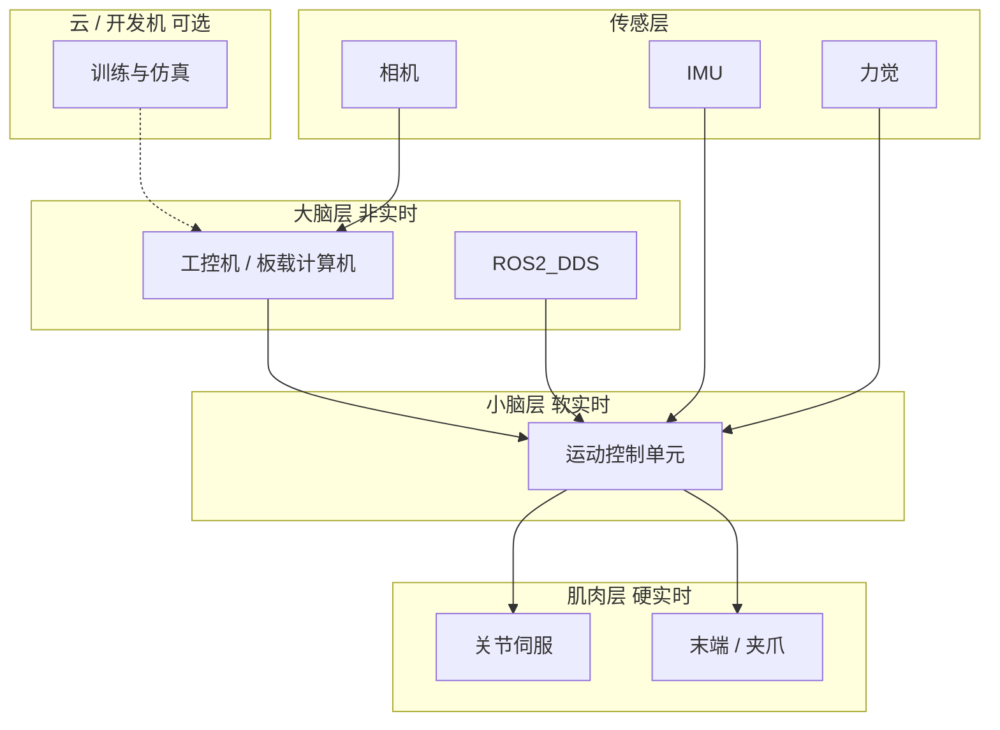
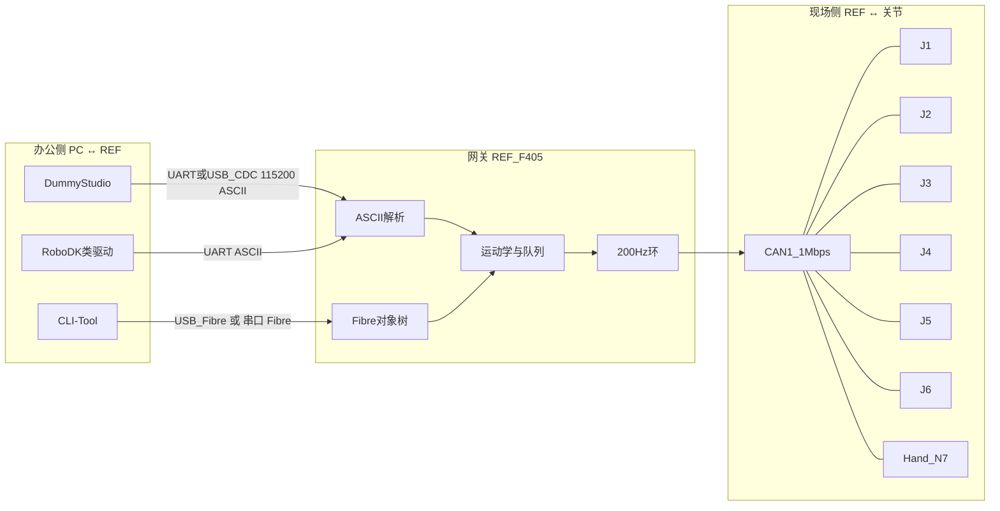

# 人形机器人网络架构入门手册

> **定位**：给零基础读者的「架构 + 协议理论 + Dummy-Robot 对照」完整学习资料。  
> **目标**：读完后能独立画出整机通信图、拆开任意一帧报文、顺着源码走完一条指令。  
> **对照工程**：本仓库 Dummy-Robot（六轴迷你机械臂）。它不是双足人形整机，但**网络骨架与工业人形相同**：上位机大脑 → 运动控制器小脑 → 关节总线肌肉。  
> **参数以当前源码为准**。系统速查见 [ARCHITECTURE_CN.md](ARCHITECTURE_CN.md)，模块入口见 [design/README.md](design/README.md)。

---

## 怎么用这份资料

建议按章节顺序读，不要跳到命令表死记。每章都是「先讲为什么 → 再讲理论 → 最后落到 Dummy 源码」。

| 阶段 | 章节 | 学完你应该能 |
|------|------|----------------|
| 建立地图 | 第 0～3 章 | 用三层模型解释整机，指出每根线、每个 MCU 干什么 |
| 打协议底子 | 第 4～6 章 | 独立讲清 UART / USB / CAN 的物理与帧结构 |
| 掌握本机协议 | 第 7～9 章 | 手算 StdId、写出 ASCII 命令、理解 Fibre 对象树 |
| 打通系统 | 第 10～11 章 | 从 PC 点一下到电机转起来，逐步对照源码 |
| 向外扩展 | 第 12～13 章 | 知道人形整机还会多哪些总线，以及下一步学什么 |

**阅读约定**：

- 「小白比喻」帮助建立直觉，不等于协议原文。
- 「落到 Dummy」给出本仓库路径，便于对照。
- 命令码、波特率、NodeID 以固件为准；若与网上文章冲突，以本仓库源码为准。

---

## 第 0 章 先看懂「整机在干什么」

### 0.1 机器人网络解决的三个问题

一台能自己动的机器人，必须同时解决：

1. **谁下命令**：人、示教器、视觉算法、规划器。
2. **谁做规划**：把「把手伸到杯子旁」变成每个关节该转到几度。
3. **谁真正出力**：每个电机按目标角度/速度/电流闭环转动。

这三件事不能挤在同一块芯片、同一根线上。原因很简单：

- 规划（运动学、轨迹）需要算力，但频率只要几十到几百 Hz。
- 电机闭环需要 **千赫到万赫** 的实时性，晚 1 ms 就会抖、啸叫、丢步。
- 线太多会像「每个关节单独拉脉冲线」那样无法维护。

所以工业界和开源项目都采用同一种骨架：**分层 + 总线**。

### 0.2 一个贯穿全文的比喻

把机器人想成一个人：

| 人体 | 机器人角色 | Dummy-Robot 对应 |
|------|------------|------------------|
| 大脑（想目标） | 上位机 PC | DummyStudio / CLI-Tool / 以后的 ROS |
| 脊髓 / 小脑（协调四肢） | 核心运动控制器 | REF（STM32F405） |
| 每块肌肉（本地发力） | 关节驱动器 | Ctrl-Step ×6（STM32F103） |
| 神经束 | 现场总线 | **CAN1**（电源 2 线 + CANH/CANL） |
| 嘴和耳朵（和外界说话） | 人机接口 | USB / UART |

关键结论：**高频闭环必须发生在关节本地**；总线上只走「设定点」和「状态」，不走 20 kHz 的电流环采样。

### 0.3 一条指令的第一张全景图

人在电脑上说：「J1 转到 90°」。真实路径是：

```text
人 → 上位机软件
  → USB 或 UART（把「意图」编码成 Fibre 或 ASCII）
    → REF 核心板解析、做限位/同步/运动学
      → 每 5 ms（200 Hz）向 6 个关节发 CAN 帧
        → 关节 MCU 把「圈数 + 限速」交给本地 20 kHz 环
          → 编码器反馈 → 电机真正转到位
            → CAN 回传到位 ACK → REF 点亮 OLED 上的 *
```

后面每一章都在把这张图拆细。现在只要记住：**不是一根线从头通到尾，而是两段网**——PC↔REF 是「办公网」，REF↔关节是「工厂现场总线」。

---

## 第 1 章 通信分层：用快递比喻打底

协议文档最容易把人劝退的，是一上来甩 OSI 七层。机器人里其实只用到三层直觉：

```text
┌─────────────────────────────────────┐
│ 应用层：这句话是什么意思？           │  ASCII / Fibre / 自定义 CAN cmd
│   例如：move_j、使能、读角度         │
├─────────────────────────────────────┤
│ 链路层：这一包怎么切、谁先发、谁校验 │  USB 事务 / UART 字节流 / CAN 帧
├─────────────────────────────────────┤
│ 物理层：电信号长什么样               │  差分双绞、USB D+/D-、TTL 电平
└─────────────────────────────────────┘
```

### 1.1 物理层：电必须先通

没有电平、地、差分，上层协议全是空谈。

| 接口 | 电气形态 | Dummy 上的典型参数 |
|------|----------|-------------------|
| UART | 单端 TTL（相对 GND） | 115200 bps，8 数据位，无校验，1 停止位 |
| USB | 差分 D+/D- + 5 V 供电 | USB FS 12 Mbps 量级，设备 VID `0x1209` PID `0x0D32` |
| CAN | 差分 CANH/CANL | **1 Mbps**，标准 11-bit ID |

**共地**：UART 必须共 GND。CAN 差分对噪声不那么敏感，但电源负极仍应形成完整回流。CANH/CANL 反接是新手第一坑。

### 1.2 链路层：把比特变成「一帧」

- **UART** 几乎没有帧：字节一个个流过来，应用层自己用换行符切「一行命令」。
- **USB** 由主机调度事务，设备不能抢着说话；固件里再把 USB 包还原成 CDC 字符流或 Fibre 数据包。
- **CAN** 天生就是帧：每帧最多 8 字节数据，带 ID、CRC、仲裁。多节点可挂同一对线上。

### 1.3 应用层：约定「这些字节表示角度」

同一条 CAN 物理总线，可以跑 CANopen、CiA 402，也可以跑 Dummy 这种「ID 里塞 Node+命令」的私有协议。  
**物理层兼容 ≠ 应用层能对话**。两边必须同一套命令码、同一套字节序、同一套单位。

Dummy 的应用层有三套，用途不同：

| 应用协议 | 走哪条物理通道 | 给谁用 |
|----------|----------------|--------|
| ASCII 文本 | USB CDC / UART4 | DummyStudio、串口助手、类 RoboDK 驱动 |
| Fibre 对象树 | USB Native / UART | CLI-Tool（`dummy0.robot.move_j`） |
| 自定义 CAN cmd | CAN1 | REF ↔ 关节 / 夹爪 |

### 1.4 四个必须分清的词

初学者常把它们混为一谈，后面会反复用到：

| 词 | 含义 | 例子 |
|----|------|------|
| **带宽** | 每秒最多能搬多少比特 | CAN 1 Mbps；UART 115200 bps |
| **延迟** | 从发到被对方处理完要多久 | USB 枚举可能要几百 ms；CAN 一帧约几十 μs |
| **抖动** | 延迟稳不稳 | 控制环最怕抖动，所以关节闭环不走 USB |
| **确定性** | 最坏情况能否保证按时到 | CAN 有优先级仲裁；Wi-Fi 没有硬实时保证 |

**设计口诀**：人机交互可以慢、可以重试；关节设定点必须准时、短包、可仲裁。

---

## 第 2 章 人形机器人的标准网络骨架

完整人形（双足 + 双臂 + 头 + 传感器）节点数往往是 Dummy 的十几倍，但分层几乎不变。

### 2.1 工业界常见的四层



| 层 | 周期 | 典型总线 | 不能容忍的事 |
|----|------|----------|--------------|
| 大脑 | 10～100 ms | Ethernet、USB、Wi-Fi | 规划算错；可以偶尔卡一下 |
| 小脑 | 1～5 ms | EtherCAT / CAN / 内部总线 | 六轴不同步 |
| 肌肉 | 50 μs～1 ms | 驱动器内部 SPI/ADC | 电流环失步 |
| 传感 | 视传感器 | GigE、MIPI、独立 CAN | 视觉延迟太大（通常不进电流环） |

Dummy 把「大脑」放在 PC，「小脑」做成 REF，「肌肉」做成 6 个 Ctrl-Step。没有独立的相机网络，IMU 只在 REF 板上给 OLED 看姿态。

### 2.2 为什么关节总线几乎都是 CAN 或 EtherCAT

| 方案 | 优点 | 代价 | 典型场景 |
|------|------|------|----------|
| 每轴一根 step/dir | 简单 | 线束爆炸、无反馈 | 开环 3D 打印机 |
| UART 星型 | 调试友好 | 一轴一根串口，扩展差 | 单电机实验 |
| **CAN** | 两线多节点、仲裁、工业成熟 | 8 字节短帧、1 Mbps 级 | Dummy、多数关节模组 |
| EtherCAT | 百 μs 同步、大带宽 | 主站协议栈复杂、成本高 | 商用人形 / 协作臂 |
| 无线到关节 | 布线少 | **不可做硬实时力矩环** | 只适合示教器、遥操作 |

Dummy 官方设计要点：关节 CAN **串联**，整臂 **4 根线**（电源正负 + CANH/CANL），避免传统脉冲式每个关节单独拉 step/dir。

### 2.3 从六轴臂到人形，网络上只多了什么

| 能力 | Dummy（本仓库） | 完整人形通常还要 |
|------|-----------------|------------------|
| 关节指令 | CAN 私有协议，200 Hz | EtherCAT / CAN-FD，1 kHz 级 |
| 全身协调 | 六轴 + 夹爪 | 多总线网关：左臂/右臂/腿/头分区 |
| 感知 | 板载 MPU6050 | 多相机、雷达、足底力、关节力矩 |
| 大脑 | PC 上的 Studio / CLI | 板载 NUC/Jetson + ROS2 |
| 安全 | 软件急停 `!STOP` | STO 硬线、安全 PLC、碰撞检测 |

学 Dummy 不是学「玩具协议」，而是学**可在桌面上完整跑通的缩小版人形网络**。把 Node 从 7 个扩到 30 个、把 CAN 换成 EtherCAT，分层思维仍然适用。

---

## 第 3 章 Dummy-Robot 网络全景

### 3.1 角色与芯片

| 角色 | 硬件 | MCU | 网络职责 |
|------|------|-----|----------|
| 上位机 | DummyStudio、CLI-Tool、RoboDK | PC | 发意图、读状态 |
| REF 核心 | REF-Unit + REF-Base | STM32F405RG | 运动学、200 Hz 环、协议网关 |
| 关节 ×6 | MotorDriver-42/20 | STM32F103CB | 20 kHz 闭环、CAN 从站 |
| 夹爪 | HandModule | CAN Node 7 | 开合角 / 电流限 |
| Peak / Dangle | 可选 | 独立 MCU | 无线示教、空间定位（子模块，常未拉取） |

### 3.2 两段网，不要画成一段



**REF 的本质是协议网关**：左边听人话（文本或对象调用），右边说关节话（CAN 短帧）。

### 3.3 物理接线（现场总线）

```text
电源正极 ──┬── J1 ── J2 ── J3 ── J4 ── J5 ── J6 ── Hand
电源负极 ──┤
CANH     ──┤     标准 CAN 总线，所有节点并联在同一对线上
CANL     ──┘
```

「串联」说的是机械上一个接一个往下传线，**电气上 CAN 是总线（多点并联）**，不是 UART 那种点对点 daisy-chain 数据转发。

每个驱动器认两类 ID：

- 本机 `canNodeId`（1～6 关节，7 夹爪）
- 广播 `0`（全体使能、重启、读角、设 Home 等）

### 3.4 通道清单（记这张表就够入门）

| 链路 | 物理 | 应用协议 | 波特率 / 速率 | 源码入口 |
|------|------|----------|---------------|----------|
| PC ↔ REF | USB OTG FS | Fibre Native + CDC ASCII | USB FS；CDC 声明 115200 | `Bsp/communication/interface_usb.*` |
| PC ↔ REF | UART4 DMA | ASCII + Fibre | **115200** | `interface_uart.*`、`OnUart4AsciiCmd` |
| PC ↔ REF | UART5 | 预留 | 115200 | `OnUart5AsciiCmd` 为空 |
| REF ↔ 关节 | CAN1 | 自定义标准帧 | **1 Mbps** | `ctrl_step.cpp` ↔ `interface_can.cpp` |
| REF ↔ 夹爪 | CAN1 Node7 | 另一套 cmd（角度/电流） | 1 Mbps | `DummyHand` |
| 单驱动调试 | 驱动板 UART1 | 文本 `c/v/p` | 115200 | `interface_uart.cpp`（F1） |

USB 描述符：VID **`0x1209`**，PID **`0x0D32`**（`usbd_desc.c`）。DummyStudio 的 `serial_config.txt` 写 `VendorID=1209`、`BaudRate=115200`。

CAN2 已在 REF 上初始化，协议回调为空，留给扩展（例如第二组关节或传感器）。

---

## 第 4 章 UART 串口（小白第一课）

学现场总线之前，先把最简单的「一根 TX、一根 RX、一根 GND」搞懂。Dummy 里 UART 同时承担：上位机调试、Fibre 备用通道、单电机不经过 REF 的直连调试。

### 4.1 一根线上每次只走 1 bit

UART 异步：双方事先约定波特率，没有共用时钟线。115200 的意思是：**每秒最多约 115200 个比特**。一个字节通常是：

```text
空闲(高电平) → 起始位(低) → D0…D7 → [可选校验] → 停止位(高)
```

Dummy 用最常见的 **8N1**：8 数据位、No parity、1 停止位。传一个字节大约 10 bit，有效字节率约 11520 字节/秒。对「一行 ASCII 命令」绰绰有余，对「6 轴 1 kHz 二进制设定点」就偏紧——这也是关节不用 UART 组网的原因。

### 4.2 为什么必须共地、必须波特率一致

- 单端信号以 GND 为参考。不共地，接收端看到的高低电平是漂的。
- 双方波特率误差一般要 < 2～3%，否则停位对不齐，出现乱码。
- TX 接对方 RX，交叉连接。接成 TX–TX 会「都能发、都听不见」。

### 4.3 Dummy 上的三处 UART

**REF（F405）** `Core/Src/usart.c`：UART4 / UART5 / USART1 均为 115200。

- UART4：DummyStudio、串口调试；ASCII 与 Fibre 可共存，由通信层分流。
- UART5：框架在，`OnUart5AsciiCmd` 未写业务。
- `printf` 的 `_write` 会同时打到 USB 和 UART4，所以 USB 连着时串口也能看到调试输出。

**关节驱动（F103）** UART1 115200，命令极简：

| 输入 | 含义 | 单位 |
|------|------|------|
| `c 0.5` | 电流模式设定点 | A |
| `v 1.0` | 速度模式设定点 | 圈/秒量级（再乘细分步） |
| `p 2.5` | 位置模式设定点 | 电机圈数 |

这是**绕过 REF 的单板通道**，适合第一次让电机转起来。整机联调应改走 CAN，否则 6 个串口无法管理。

### 4.4 文本协议如何切包

UART 没有「消息边界」。REF 用 `ascii_processor` 按行组装，最长 `MAX_LINE_LENGTH = 256`。你在串口助手里必须发换行（`\n` 或 `\r\n`），否则命令会一直等。

---

## 第 5 章 USB：电脑怎么认出机械臂

### 5.1 主机与设备

USB 不是对等网：电脑是 Host，REF 是 Device。设备插入后要 **枚举**：主机读描述符（VID/PID/配置），再加载驱动。

Dummy 把 REF 做成 **复合用途设备**：

- **CDC（通信设备类）**：操作系统认成虚拟串口。DummyStudio、串口助手走这条，内容是 ASCII。
- **Native / Bulk（ODrive 风格）**：CLI-Tool 的 fibre 走这条，内容是二进制对象协议。

所以「插上 USB」不等于「只有一个 COM 口」。Windows 上可能同时看到串口和专用接口；Linux 上 fibre 常用 `usb` 路径发现。

### 5.2 VID / PID 是身份证

| 字段 | Dummy 值 | 作用 |
|------|----------|------|
| VID | `0x1209` | pid.codes 开源硬件常用号段 |
| PID | `0x0D32` | 区分具体产品（另有 `0x0D31/0x0D33` 相关描述） |

上位机用 VID 过滤设备（Studio 配置 `VendorID=1209`）。换 VID 而不改上位机，就会「线插上了软件找不到」。

### 5.3 为什么关节不用 USB

USB 由主机轮询，从设备不能保证「每 50 μs 我一定能发出电流采样」。线缆、接头、枚举也不适合做 6～20 个关节的现场布线。USB 适合 **PC↔一个控制器**；关节适合 **CAN/EtherCAT**。

### 5.4 落到 Dummy 的任务模型

`InitCommunication()` 拉起通信任务（栈很大，约 45000，因为 Fibre 对象树缓冲）：

1. `CommitProtocol()` 发布 Fibre 对象树。
2. 置位 `endpointListValid`，`Main()` 才继续往下初始化机器人。
3. 启动 UART / USB / CAN1 / CAN2 服务。

USB 收包经 `UsbServerTask`；中断里只做最少工作，重活放到 `UsbDeferredInterruptTask`（优先级 AboveNormal）。这是嵌入式 USB 的标准手法：**ISR 要短**。

---

## 第 6 章 CAN 总线完整理论

CAN 是 Dummy 关节网的物理与链路基础。把这一章吃透，后面自定义命令只是「在 ID 和 8 字节里填什么」。

### 6.1 它在解决什么

1980 年代汽车上传感器越来越多，再点对点拉线会把车做成线束博物馆。CAN 的设计目标：

- **两根线挂很多节点**
- 任一节点可主动发（多主）
- 同时发时 **ID 小的优先**（仲裁），不破坏已在线上的帧
- 每帧带 CRC，出错自动重发（本仓库驱动里 `AutoRetransmission` 被关掉了，见下节「与标准的差异」）

### 6.2 差分：为什么抗干扰

CANH 与 CANL 走相反的电压。接收端看的是**差值**：

- 隐性（1）：两线压差约 0，总线空闲
- 显性（0）：CANH 高、CANL 低，压差约 2 V

电机附近的共模噪声两根线一起抬、一起压，差值几乎不变。这就是关节柜里用 CAN 而不是 TTL UART 的物理原因。

### 6.3 终端电阻 120 Ω

总线是传输线。两端各接 120 Ω（并联后约 60 Ω），用来：

- 匹配特性阻抗，减少反射
- 给显性电平提供电流回路

**两端各一个，不是每个节点一个。** 中间节点再并 120 Ω 会把总线拉得太「重」，边沿变差、误码上升。Dummy 板卡是否已做板载电阻，接线时要确认只在物理两端生效。

### 6.4 标准帧长什么样

Dummy 用 **标准帧（11-bit ID）**，不用 29-bit 扩展帧。

```text
SOF | 11-bit ID | RTR | 控制(含 DLC) | 0～8 字节数据 | CRC | ACK | EOF
```

对应用开发者，日常只关心：

| 字段 | Dummy 取值 | 含义 |
|------|------------|------|
| StdId | `(nodeID << 7) \| cmd` | 谁 + 干什么 |
| IDE | 标准帧 | 11-bit |
| RTR | 数据帧 | 不是远程请求 |
| DLC | 8 | 数据长度；不足也常发满 8 字节 |
| Data[0..7] | float / uint32 小端 | 设定点或参数 |

**仲裁**：ID 越小优先级越高。广播 `nodeID=0` 的帧 ID 往往更小，更容易抢到总线——符合「全体急停/使能应当优先」的直觉。

### 6.5 波特率怎么算（本仓库为 1 Mbps）

公式：

```text
比特率 = CAN 时钟 / ( Prescaler × (1 + BS1 + BS2) )
```

`1` 是同步段。采样点大约在 `(1+BS1) / (1+BS1+BS2)`。

**REF（F405）**

- HSE 8 MHz → PLL → SYSCLK 168 MHz → APB1 **42 MHz**（CAN 时钟）
- Prescaler=7，BS1=3 TQ，BS2=2 TQ
- `42e6 / (7 × 6) = 1 000 000` → **1 Mbps**
- 采样点 ≈ 4/6 ≈ 67%

**驱动（F103）**

- HSE **12 MHz** → PLL×6 → 72 MHz → APB1 **36 MHz**
- Prescaler=4，BS1=5 TQ，BS2=3 TQ
- `36e6 / (4 × 9) = 1 000 000` → **1 Mbps**
- 采样点 ≈ 6/9 ≈ 67%

两端比特率必须一致。分析仪也要设 1 Mbps，否则「完全看不到帧」。

### 6.6 过滤器：硬件先帮你扔掉别人的包

F1 驱动里过滤器 Mask 全 0（全收），然后在软件里判断：

```text
id  = StdId >> 7
cmd = StdId & 0x7F
仅当 id==0 或 id==本机 canNodeId 时进入 OnCanCmd
```

硬件全收在节点少时没问题；节点变多时应改成硬件过滤，减轻 CPU。这是走向人形多关节时的典型优化。

### 6.7 和教科书 CAN 的两处差异（读源码时别惊讶）

1. **应用层不是 CANopen**。没有 PDO/SDO 字典，就是私有 cmd 表。
2. REF 与驱动的 Cube 配置里 **`AutoRetransmission = DISABLE`**。标准 CAN 控制器默认出错会自动重发；这里关掉后，瞬时干扰可能导致「丢一帧设定点」。200 Hz 环会在下一拍再发位置，点到点运动通常仍能收敛，但**不是**高可靠性运动总线的最佳实践。二次开发若做力矩/轨迹跟踪，应评估打开自动重发与总线错误处理。

### 6.8 线长与 1 Mbps

经验：1 Mbps 适合数米到十几米量级的短总线。Dummy 整臂很短，完全够用。人形全身走线变长时，要么降速（500 kbps），要么上 CAN-FD / EtherCAT。

---

## 第 7 章 Dummy 自定义 CAN 应用协议

理论有了，开始填「ID 和 8 字节」。这是掌握本系统最关键的一章。

### 7.1 ID 打包规则（请动手算）

```text
StdId = (nodeID << 7) | cmd
```

- `nodeID`：占用 ID 的高位（注释写 4 bit，实践中 0～7 足够）
- `cmd`：低 7 bit（0x00～0x7F）

**例 1** 使能 J1：`node=1`，`cmd=0x01`

```text
StdId = (1 << 7) | 0x01 = 0x80 | 0x01 = 0x081
```

**例 2** J3 限速位置（运动主路径）：`node=3`，`cmd=0x07`

```text
StdId = (3 << 7) | 0x07 = 0x180 | 0x07 = 0x187
```

**例 3** J1 回传位置 ACK：`node=1`，`cmd=0x23`

```text
StdId = 0x080 | 0x23 = 0x0A3
```

**例 4** 广播使能：`node=0`，`cmd=0x01` → `StdId = 0x001`

分析仪里按十六进制过滤这些 ID，就能看见「谁在对谁说话」。

### 7.2 字节序与单位

STM32 小端。`float` 按 IEEE 754 的 4 字节原样拷进 Data[0..3]。

| 物理量 | 总线上的类型 | 单位 | 换算 |
|--------|--------------|------|------|
| 使能 | uint32 | 0 / 1 | — |
| 电流设定/限制 | float | **A** | 驱动内常 ×1000 变成 mA |
| 速度 | float | **转子圈/秒** | 再乘细分步进入规划器 |
| 位置 | float | **转子圈数** | REF：`圈数 = 角度/360 × 减速比` |
| 时间（0x06） | float | 秒 | 与位置拼成 8 字节 |
| DCE 增益 | int32 | 内部增量 | 写入 EEPROM 可选 |

方向：若关节 `inverseDirection==true`，REF 在换算前先取反角度，驱动始终看到「自己的正向圈数」。

**J1 转到 90° 的圈数**（减速比 50）：

```text
圈数 = 90 / 360 × 50 = 12.5
```

这 12.5 以 float 放入 0x07 的前 4 字节。

### 7.3 命令码全表（关节 Ctrl-Step）

方向「→」表示 REF 发给驱动，「←」表示驱动回答。

#### 即时运动（0x01～0x07，一般不强制写 EEPROM）

| cmd | 方向 | 功能 | Data 布局 | Dummy 主路径？ |
|-----|------|------|-----------|----------------|
| 0x01 | → | 使能 / 失能 | uint32：1 使能（进速度模式待命），0 停止 | 整机 `set_enable` |
| 0x02 | → | 触发编码器校准 | 可空 | 首次上电 / 换编码器 |
| 0x03 | → | 电流设定点 | float A | 调试用 |
| 0x04 | → | 速度设定点 | float r/s | 调试用 |
| 0x05 | → | 位置设定点 | float 圈；`data[4]=1` 要求 ACK | Fibre `set_position` |
| 0x06 | → | 带时间到位 | float 圈 + float 秒 | 较少用 |
| **0x07** | → | **限速位置** | **float 圈 + float 限速 r/s** | **MoveJ/MoveL 主用，必 ACK** |

0x07 是整机运动的主动脉：200 Hz 环对 J1～J6 各发一帧。驱动收到后切位置模式、改 `ratedVelocity`、设位置，并**立刻**用 0x23 回当前角和是否 `STATE_FINISH`。

#### 带存储的参数（0x11～0x1B）

`data[4] != 0` 时常置 `CONFIG_COMMIT`，稍后写入模拟 EEPROM。

| cmd | 功能 |
|-----|------|
| 0x11 | 改 NodeID |
| 0x12 | 电流上限 |
| 0x13 | 速度上限 |
| 0x14 | 加速度（REF 侧默认 `data[4]=0`，不存盘） |
| 0x15 | 以当前位置为 Home，并保存 offset |
| 0x16 | 上电自动使能 |
| 0x17～0x1A | DCE Kp / Kv / Ki / Kd |
| 0x1B | 堵转保护开关 |

改 NodeID 后必须与机械安装位置一致，否则会出现「指令发给 J2、J3 在动」。

#### 查询（0x21～0x24）

驱动用**同一 cmd** 回包，StdId 仍带本机 node。

| cmd | 内容 |
|-----|------|
| 0x21 | 电流 float + 完成标志 |
| 0x22 | 速度 |
| 0x23 | 位置圈数 + 完成标志（运动 ACK 也走它） |
| 0x24 | Home offset |

#### 维护

| cmd | 功能 |
|-----|------|
| 0x7e | 擦除配置 / 恢复 |
| 0x7f | 重启 `NVIC_SystemReset` |

### 7.4 反馈如何回到 REF

```text
驱动 OnCanCmd(0x07)
  → 填 data[0..3] = 当前圈数 float
  → data[4] = (state == FINISH)
  → StdId = (canNodeId << 7) | 0x23
  → CAN_Send

REF OnCanMessage（CAN1）
  → id = StdId >> 7, cmd = StdId & 0x7F
  → cmd==0x23：motorJ[id]->UpdateAngleCallback(float, flag)
  → 圈数换回角度：angle = 圈数 / 减速比 × 360（再按 inverse 取反）
  → UpdateJointAnglesCallback() 置位 jointsStateFlag
  → OLED 用 * / _ 显示各轴是否到位
```

SEQ 模式要等标志齐全才取队列下一条；INT 模式新指令直接覆盖目标。

### 7.5 夹爪 Node 7：另一套 cmd（易混点）

夹爪**复用** `(7 << 7) | cmd` 形式，但 **cmd 含义与关节表不同**：

| cmd | DummyHand | 数据 |
|-----|-----------|------|
| 0x01 | 最大电流（0～1 A），0 当作失能 | float |
| 0x02 | 开合角度（代码里限制 0～30°，架构表写 0～45° 以机械为准） | float |

`SetEnable(false)` 并不是发关节的 0x01=0，而是把电流限打到 0。读协议时务必看是 `ctrl_step.cpp` 还是 `DummyHand`。

### 7.6 带宽直觉：200 Hz × 6 轴吃得消吗

粗算一帧约 100～130 bit（含开销）。6 轴 × 200 Hz × 2（命令+ACK）≈ 2400 帧/s。  
1 Mbps / 130 ≈ 7700 帧/s 量级，余量足够。若升到 1 kHz 全身 20 轴，CAN 2.0 会开始紧张，这就是人形转向 CAN-FD/EtherCAT 的数字原因。

---

## 第 8 章 ASCII 文本协议（人能读的那一层）

### 8.1 为什么还要文本

Fibre 适合程序互调；ASCII 适合：

- 串口助手手打
- Unity 上位机拼字符串
- 把 RoboDK 一类「发一行指令」的驱动迁过来

代价：解析慢、易拼写错、不适合 1 kHz 轨迹流。Dummy 用它做**点到点与示教**，高频轨迹走 TRJ 模式的二进制路径（仍在完善）。

### 8.2 行协议规则

- 通道：USB CDC 与 UART4 逻辑相同（两份回调几乎复制）。
- 未使能时，除 `!` 类控制外，运动命令不会当正常运动执行（代码：`_cmd[0]=='!' || !dummy.IsEnabled()` 进入急停/启停分支）。
- 运动行以 `>` 或 `@` 开头，推进 FIFO，回复剩余空位数字。

### 8.3 命令表

| 前缀 | 例子 | 行为 | 典型应答 |
|------|------|------|----------|
| `!` | `!STOP` | 急停，清空/中断运动 | `Stopped ok` |
| `!` | `!START` | `SetEnable(true)` | `Started ok` |
| `!` | `!DISABLE` | 失能 | `Disabled ok` |
| `#` | `#GETJPOS` | 读 6 关节角（度） | `ok j1 j2 ... j6` |
| `#` | `#GETLPOS` | 读末端 XYZABC（mm / °） | `ok x y z a b c` |
| `#` | `#CMDMODE 2` | 设指令模式 | `Set command mode to [2]` |
| `>` | `>0,0,90,0,0,0,20` | MoveJ 入队，可选末项速度 | FIFO 剩余整数 |
| `@` | `@100,0,150,0,0,0` | MoveL 入队（内部 IK） | FIFO 剩余整数 |

队列深度 16（`osMessageQueueNew(16, 64)`），单条命令最长约 64 字节。

### 8.4 和 Fibre 如何分工

| 你想做 | 更合适 |
|--------|--------|
| 示教、拖一点看一看 | ASCII + DummyStudio |
| 写 Python 脚本批量测关节 | Fibre + CLI-Tool |
| 改 PID、NodeID、电流限 | Fibre `dummy0.robot.joint_1.set_*` |
| 紧急停 | 两种都行；ASCII `!STOP` 最直观 |

同一 USB 设备上可以两种都在：CDC 走文本，Native 走 Fibre。

---

## 第 9 章 Fibre 对象协议（给程序用的远程函数）

### 9.1 用文件夹理解对象树

Fibre 源自 ODrive 生态：设备不是「收一行字符串」，而是把内部对象**发布成一棵树**，PC 像访问本地对象一样调用。

```text
dummy0
├── serial_number          只读
├── get_temperature()      函数
└── robot
    ├── move_j(j1..j6)
    ├── move_l(x,y,z,a,b,c)
    ├── set_enable / reboot / homing / resting
    ├── set_joint_speed / set_joint_acc / set_command_mode
    ├── joint_1 … joint_6 / joint_all
    │     angle, set_position, set_enable, set_dce_kp, …
    ├── hand
    └── tuning
```

CLI 里写 `dummy0.robot.joint_1.set_enable(True)`，本质是：PC 按 endpoint 编号发二进制调用，固件跳到 `CtrlStepMotor::SetEnable`，再变成 CAN 0x01。

### 9.2 为什么比 ASCII 适合二次开发

- 类型明确：float 就是 float，不会 `"90"` 和 `90` 搞混。
- 可发现：连接后读 JSON 端点表，工具自动生成属性，不必同步维护一份 PDF 命令表。
- 可嵌套：关节对象复用同一套 `MakeProtocolDefinitions()`。

代价：必须双方 fibre 版本兼容；乱改 endpoint 布局会导致「能枚举 USB、一调函数就失败」。

### 9.3 发布过程（固件）

```text
CommunicationTask
  → CommitProtocol() / MakeObjTree()
       serial_number
       get_temperature → AdcGetChipTemperature()
       robot → dummy.MakeProtocolDefinitions()
  → endpointListValid = true
```

树的「叶子」在：

- `UserApp/protocols/cmd_protocol.cpp` 根对象
- `dummy_robot.h` 的 `DummyRobot::MakeProtocolDefinitions`
- `ctrl_step.hpp` 的关节 API

新增一个「整机拍一下」功能：在 Robot 加 C++ 方法，再在 `MakeProtocolDefinitions` 里 `make_protocol_function`，不要去改 `fibre/cpp` 内核。

### 9.4 PC 侧发现

```text
run_shell.py
  → fibre.find_all(path=usb 或 serial:COMx)
  → 读 endpoint JSON、算 CRC、构造 RemoteObject
  → 交互壳里出现 dummy0
```

最小脚本见 `3.Software/CLI-Tool/_addition/ref_demo.py`。

### 9.5 和 CAN 的关系（务必建立这张图）

```text
Fibre 调用 set_enable
    ≠  USB 包直接到电机
    =  REF C++ 函数 → 再封装 CAN 0x01

Fibre 调用 move_j
    =  DummyRobot::MoveJ → 算同步限速 → 200 Hz 发 0x07
```

**Fibre 从不替代 CAN。** 它只是 PC 操纵 REF 的遥控杆。

---

## 第 10 章 控制环、时序与同步

网络设计必须服务控制，否则「协议都会了，臂还是抖」。

### 10.1 两套时钟，各干各的

```text
REF  TIM7  200 Hz  ──  把目标角度变成 CAN 设定点，做 FK 更新 OLED
关节 TIM4  20 kHz ──  读 MT6816 → DCE 控制律 → TB67H450 斩波
关节 TIM1  100 Hz ──  按键与 LED
```

200 Hz 对应 5 ms 一拍。人看到的「平滑运动」来自关节内部的梯形规划和 20 kHz 电流/位置环，不是来自 USB。

ISR 里只 `vTaskNotifyGiveFromISR`，真正 `MoveJoints()` 在 Realtime 任务里跑——避免在中断里发 CAN、算浮点导致优先级反转。

### 10.2 为什么闭环必须在关节

若把编码器读数经 CAN 送到 REF，算完 PID 再发回电流：

- 一来一回就算 200 μs，20 kHz（50 μs）环直接破产
- 总线一抖，六个关节一起抖

所以：**总线传设定点；力矩/位置内环本地化**。这是所有现代人形、协作臂的铁律。

### 10.3 指令模式（应用层的「调度策略」）

| 模式 | 值 | 发送特征 | 可打断 | 典型场景 |
|------|----|----------|--------|----------|
| SEQ | 1 | 低频、FIFO | 否 | 码垛、视觉抓取，关键点之间停一下 |
| INT | 2 默认 | 随时来 | 是 | 手柄/实时同步 |
| TRJ | 3 | 约 200 Hz 流 | 否 | 雕刻、3D 打印（精细跟踪仍在完善） |
| TUN | 4 | 扫频 | — | 调 DCE |

ASCII 的 `#CMDMODE` 与 Fibre 的 `set_command_mode` 改的是同一变量。

### 10.4 MoveJ 如何变成 6 帧 CAN

1. 检查各轴限位。
2. 算与当前角的差分；用**最大差分轴**结合减速比和 `jointSpeed` 估时间。
3. 给其他轴分配 `dynamicJointSpeeds`，让大家几乎同时到。
4. 清 `jointsStateFlag`，写入 `targetJoints`。
5. 200 Hz：`SetAngleWithVelocityLimit` → CAN **0x07**。
6. 收齐 0x23 完成标志 → SEQ 才弹下一条。

MoveL 先 `SolveIK`（最多 8 解，丢超限，选相对当前姿态变化最小的一组），然后与 MoveJ 同一条下发路径。

### 10.5 「广播同步」的设计意图 vs 现状

官方设想过：各驱动先缓存目标，再用 Node0 广播一拍对齐。  
**当前实现**是：REF 以 200 Hz 依次向 J1～J6 下发；Node0 用于全体使能/重启/读角/Home。六轴起始时刻相差若干百微秒，对 30°/s 级示教够用。若要做力控或高速轨迹，需要加强「影子寄存器 + 同步脉冲」。

---

## 第 11 章 三条完整数据通路走读

把协议串成电影。建议对着源码点进去看一遍。

### 11.1 路径 A：CLI 让 J1 转到 90°（Fibre → CAN）

```text
dummy0.robot.set_enable(True)
dummy0.robot.move_j(90, 0, 90, 0, 0, 0)   # 示例，注意 J3 限位
```

1. USB Native 收到 fibre 调用，进入 `DummyRobot::MoveJ`。
2. 限位检查、算同步速度、写入目标。
3. `ThreadControlLoopFixUpdate` 被 TIM7 唤醒。
4. `CtrlStepMotor::SetAngleWithVelocityLimit`：  
   `圈数 = ±角度/360*reduction`，`StdId = (1<<7)|0x07`。
5. F1 `OnCanCmd(0x07)` 改位置环设定点。
6. 回 0x23；`UpdateAngleCallback` 更新 `angle`。
7. OLED 对应关节从 `_` 变 `*`。

**对照文件**：

- `3.Software/CLI-Tool/`
- `cmd_protocol.cpp` / `dummy_robot.h`
- `dummy_robot.cpp`（MoveJ）
- `ctrl_step.cpp`（0x07）
- `Ctrl-Step-.../interface_can.cpp`
- `can_protocol.cpp`（0x23）

### 11.2 路径 B：串口助手 MoveJ（ASCII → 同一 CAN）

```text
!START
>90,0,90,0,0,0,15
```

1. UART4 或 USB CDC 拼出一行。
2. `OnUart4AsciiCmd` / `OnUsbAsciiCmd` 见首字符 `>`，`commandHandler.Push`。
3. `ThreadControlLoopUpdate` 阻塞 `Pop`，`ParseCommand` 解析 6 个角。
4. 此后与路径 A 的第 3 步合并。

可见：**两种上位机协议在 REF 内部汇合，现场总线只有一种。**

### 11.3 路径 C：单驱动板串口（不经过 REF）

```text
p 1.0
```

F1 `OnUartCmd` 进位置模式。用于校准后的第一次呼吸。  
没有 NodeID、没有同步、没有运动学。确认单肌有力之后，再接到 CAN 上接受「小脑」指挥。

### 11.4 上电顺序（网络视角）

```text
各驱动：编码器校准（首次或双键）→ 短按进入闭环或等 CAN 使能
REF：HAL + FreeRTOS → InitCommunication（必须等 Fibre 端点就绪）
    → dummy.Init（默认 INT、关节速度 30°/s）
    → IMU / OLED
    → 三线程 + TIM7 200 Hz
PC：USB 枚举 → START / set_enable → 运动命令
```

通信任务未就绪就发运动，会表现为「USB 口在、命令无反应」。

---

## 第 12 章 对照完整人形：学会 Dummy 之后怎样升级

| Dummy 里的概念 | 人形工程里的对应 | 学习时注意 |
|----------------|------------------|------------|
| PC Fibre/ASCII | ROS2 topic/action、DDS、gRPC | 仍是「大脑语言」，不要直接进关节 |
| REF 200 Hz | 全身运动控制 / Whole-Body Control | 周期可能 1 kHz，但仍是设定点 |
| CAN 1 Mbps 私有 cmd | CANopen CiA 402、CAN-FD、EtherCAT CoE | 对象字典 ≈ 更标准的 Fibre |
| NodeID 1～7 | 从站地址、Alias | 分区：左臂一条总线、右臂一条 |
| 0x07 位置+限速 | Profile Position / CSP 周期同步位置 | CSP 需要更严的同步时钟 |
| 板载 MPU6050 | 躯干 IMU 进状态估计 | 常走独立 SPI/CAN，不和关节抢 1 Mbps |
| Peak 无线示教 | 手柄、VR、遥操作 | 无线只到大脑，不到电流环 |
| `!STOP` | STO、安全继电器 | 安全不能只靠应用层字符串 |

**升级路线建议**（仍用本仓库练手）：

1. 用 USB-CAN 分析仪抓一帧 0x07，对照第 7 章手算 ID。
2. 新增一条 ASCII 命令（如 `#GETMODE`），只改 `ascii_protocol.cpp`。
3. 在 Fibre 树加只读属性（如当前模式），走通「协议层要薄、语义在 Robot」。
4. 阅读 EtherCAT 的「过程数据 + 同步管理器」资料，用本章的「设定点 vs 内环」去对照。

---

## 第 13 章 自学路径与自测

### 13.1 推荐一周节奏

| 天 | 任务 | 通过标准 |
|----|------|----------|
| D1 | 第 0～3 章 + 对照实物/照片 | 能默画两段网和 4 根线 |
| D2 | 第 4～5 章，串口助手发 `!START` | 有 `Started ok` |
| D3 | 第 6 章，分析仪 1 Mbps 看总线 | 能指出 SOF/ID/数据 |
| D4 | 第 7 章，手算 J2 的 0x07 ID | 得到 `0x107` |
| D5 | 第 8～9 章，CLI 读 `joint_1.angle` | 与 OLED 一致 |
| D6 | 第 10～11 章，单轴 ±5° | 5 s 内到位，无啸叫 |
| D7 | 第 12 章 + 自测题 | 全对或能查源码纠正 |

### 13.2 自测题（建议闭卷后再翻源码）

1. 为什么 20 kHz 环不能放在 REF 里通过 CAN 做完？  
2. UART 115200 和 CAN 1 Mbps，哪条更适合 6 轴 200 Hz 设定点？写出数量级比较。  
3. `StdId=0x287` 是哪个节点、什么命令？（`(node<<7)|cmd`）  
4. 夹爪 `0x01` 和关节 `0x01` 含义是否相同？  
5. MoveL 在哪一层变成关节角？CAN 上有没有 XYZ？  
6. Fibre 断了，能否仍用串口 ASCII 控制？依据是什么？  
7. 终端电阻应该放几个、放在哪？  
8. 本仓库 CAN 比特率是多少？F4 与 F1 的 Prescaler 为什么不同却能互通？  
9. SEQ 和 INT 对 0x23 标志的依赖有何不同？  
10. 若要加第 8 个 CAN 节点，要改协议层的哪三处（REF 发、驱动收、NodeID 分配）？

**简答要点**（先自己写再看）：  
1. 周期 50 μs，总线往返不够，且抖动会毁电流环。  
2. CAN；UART 有效载荷大约 10 kB/s，CAN 约 100 kB/s 量级且可多主。  
3. `0x287>>7=5`，`0x287&0x7F=0x07` → J5 限速位置。  
4. 不同：夹爪是电流限，关节是使能。  
5. REF 内 IK；CAN 只有圈数。  
6. 能，ASCII 走 CDC/UART4，与 Fibre 并列。  
7. 物理两端各 120 Ω。  
8. 1 Mbps；时钟不同，分频与位时段 complementary。  
9. SEQ 等齐再下一条；INT 新目标直接覆盖。  
10. `ctrl_step` 发送封装、F1 `OnCanCmd` 过滤、EEPROM/序列号默认 ID；若要运动学还要改 `DummyRobot`。

### 13.3 故障时按层排查（网络专用）

```text
物理：电源极性、共地、CANH/L、终端、波特率
链路：分析仪有无帧、ID 是否 1 Mbps 下可识别、是否只有错误帧
应用：NodeID 是否冲突、cmd 是否用了夹爪表、单位是否把度当成圈
网关：REF 是否 InitCommunication 完成、是否已 START 使能
控制：校准没有、电流限太小、限位把 MoveJ 拒了
```

「加一个节点全挂」：先拔最新节点。总线被错误节点显性占死时，所有通信都会停。

---

## 附录 A 源码地图（网络相关）

| 你想找 | 路径 |
|--------|------|
| REF 通信启动 | `2.Firmware/Core-STM32F4-fw/Bsp/communication/` |
| ASCII | `UserApp/protocols/ascii_protocol.cpp` |
| Fibre 根树 | `UserApp/protocols/cmd_protocol.cpp` |
| CAN 反馈 | `UserApp/protocols/can_protocol.cpp` |
| CAN 命令发送 | `Robot/actuators/ctrl_step/ctrl_step.cpp` |
| 夹爪 CAN | `Robot/instances/dummy_robot.cpp` 中 `DummyHand` |
| 200 Hz 环 | `UserApp/main.cpp` |
| F4 CAN 比特定时 | `Core/Src/can.c`（Prescaler 7） |
| F4 时钟 | `Core/Src/main.c` `SystemClock_Config` |
| USB VID/PID | `USB_DEVICE/App/usbd_desc.c` |
| 驱动 CAN 解析 | `Ctrl-Step-Driver-STM32F1-fw/UserApp/protocols/interface_can.cpp` |
| 驱动 UART `c/v/p` | `.../interface_uart.cpp` |
| 驱动过滤与收包 | `.../Core/Src/can.c` |
| 默认 NodeID | `.../UserApp/main.cpp` 按 MCU 序列号 |
| CLI | `3.Software/CLI-Tool/` |
| Studio 串口配置 | `3.Software/DummyStudio/.../serial_config.txt` |
| 模块设计 | `5.Docs/design/REF-Comm.md` 等 |

---

## 附录 B 术语表

| 术语 | 一句话 |
|------|--------|
| REF | 核心控制器，PC 与关节之间的网关 |
| Ctrl-Step | 关节闭环步进驱动 |
| NodeID | CAN 节点号，0 为广播 |
| StdId | 11-bit 帧 ID，本项目编码为节点+命令 |
| DLC | 本帧数据字节数，最大 8 |
| Fibre | 远程对象协议，ODrive 生态 |
| CDC | USB 虚拟串口类 |
| DCE | 驱动内 Kp/Kv/Ki/Kd 一组 |
| MoveJ / MoveL | 关节空间 / 笛卡尔空间运动 |
| 设定点 setpoint | 外环送给内环的目标，不是 PWM 本身 |
| 硬实时 | 超时即失败（电流环）；相对软实时（规划偶尔晚一拍） |
| CANopen / EtherCAT | 更标准化的工业从站协议，Dummy 未采用 |
| STO | 安全转矩切断，硬件级断电，高于 `!STOP` |

---

## 附录 C 与其它文档的分工

| 文档 | 读它做什么 |
|------|------------|
| **本文** | 从零学会架构与协议理论，并能对照本仓库 |
| [ARCHITECTURE_CN.md](ARCHITECTURE_CN.md) | 参数表、任务表、二次开发地图（速查手册） |
| [design/README.md](design/README.md) | 每个目录的类与修改点 |
| [PROJECT_GUIDE_CN.md](../PROJECT_GUIDE_CN.md) | 仓库怎么打开、工具链 |
| [content/HANDBOOK_OUTLINE_CN.md](content/HANDBOOK_OUTLINE_CN.md) | 偏「动手调通」的操作手册大纲，不替代本文的理论 |

---

*版本：按仓库当前固件整理。协议以 `ctrl_step.cpp` 与 `interface_can.cpp` 为准。*
