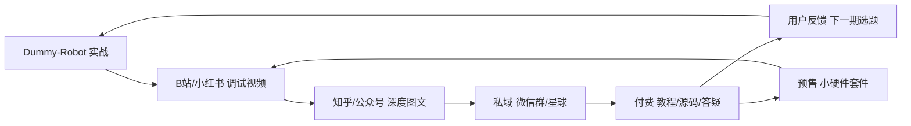

# 技术内容 + 数字产品 · 6 个月执行计划

> **适用对象**：嵌入式工程师 · 在职试水 · ToC · 南京  
> **核心素材**：Dummy-Robot 二次开发实战  
> **创建日期**：2026-07-12  
> **关联文档**：
> - [第 1 条 B 站视频脚本](BILIBILI_EP01_SCRIPT_CN.md)
> - [调通实战手册目录与写作要点](HANDBOOK_OUTLINE_CN.md)

---

## 一、定位与人设

### 一句话定位

> 帮嵌入式爱好者把开源机械臂从「能亮」调到「能动」。

### 人设标签

- 南京 · 嵌入式工程师（在职）
- Dummy-Robot 二次开发实战
- 不讲 PPT，只讲示波器、CAN 日志、真实排错

### 目标用户（ToC）

| 人群 | 痛点 | 付费意愿 |
|------|------|----------|
| 大学生 / 研究生 | 做毕设、竞赛，调不通 | 中（99 元以内） |
| 嵌入式转行新手 | 想学机器人，资料太散 | 高（99–299 元） |
| DIY 硬件爱好者 | 买了板子不会调 | 高（149–499 元） |
| 在职工程师业余玩 | 没时间踩坑，想买 checklist | 很高（199–499 元） |

### 不碰的人群

工厂采购、企业 MES 定制（ToB），与当前路径无关。

---

## 二、产品矩阵

由轻到重，6 个月逐步上线：

```
免费内容（引流）
    ↓
引流品（9.9 元，筛选付费用户）
    ↓
主力品（99 元，第 8 周目标产品）
    ↓
利润品（199–499 元，有口碑后再上）
    ↓
订阅品（星球/社群 99 元/年，第 4 月起）
```

| 阶段 | 产品名 | 定价 | 上线时间 | 内容 |
|------|--------|------|----------|------|
| 引流品 | 《CAN 总线调试速查表》PDF | 9.9 元 | 第 6 周 | 10 页：接线、终端电阻、常见帧格式、排错流程 |
| **主力品** | **《Dummy-Robot 调通实战手册》** | **99 元** | **第 8 周** | 见 [HANDBOOK_OUTLINE_CN.md](HANDBOOK_OUTLINE_CN.md) |
| 利润品 A | 《驱动固件二次开发指南》 | 199 元 | 第 14 周 | 基于 `5.Docs/design/` 整理 |
| 利润品 B | 1v1 语音答疑（60 分钟） | 299 元 | 第 12 周起 | 每周限 2 单 |
| 订阅品 | 「机械臂调试圈」知识星球 | 99 元/年 | 第 16 周 | 周报 + 问答 + 源码更新 |

---

## 三、平台策略

| 平台 | 作用 | 发布频率 | 内容形式 |
|------|------|----------|----------|
| **B 站** | 信任建立、长尾搜索 | 2 条/月 | 5–15 分钟实拍调试 |
| **小红书** | 触达新手、引流私域 | 4 条/月 | 1–3 分钟竖屏，强标题 |
| **知乎** | SEO、专业背书 | 2 篇/月 | 2000 字排错长文 |
| **微信公众号** | 私域沉淀、卖课转化 | 2 篇/月 | 教程连载、产品更新 |
| **微信群** | 答疑、反馈、预售调研 | 日常维护 | 免费群 → 付费星球 |

**账号名建议三平台统一**：如 `嵌入式机械臂调试笔记` 或 `南京嵌入式Lab`。

---

## 四、内容日历（前 12 周）

### 第 1–4 周：冷启动（只发免费内容，不卖课）

| 周 | B 站 / 小红书标题 | 知乎长文 | 素材来源 |
|----|-------------------|----------|----------|
| W1 | 我花 3 周调通 Dummy-Robot 第 1 个关节 | — | 实际调试过程 |
| W1 | 嵌入式工程师的副业：为什么不接外包 | — | 真实想法 |
| W2 | CAN 总线连 6 个节点，我踩了这 3 个坑 | CAN 总线调试完整指南 | CAN 接线 / 日志 |
| W2 | 步进电机闭环：从抖到稳的调参过程 | — | 示波器 / 电流波形 |
| W3 | Dummy-Robot 烧录全流程（ST-Link 实拍） | 固件烧录与首次上电避坑 | 烧录过程 |
| W3 | 200 元 vs 2000 元编码器，实测差别 | — | 对比测试 |
| W4 | 关节不转？5 步排查法 | Dummy-Robot 10 大高频故障 | 故障合集 |
| W4 | 开源机械臂值不值得玩？我的真实成本 | 开源六轴机械臂入门指南 | 成本清单 |

**W4 检查点**：

- [ ] 4 平台账号已开，头像 / 简介统一
- [ ] 免费微信群已建，目标 30 人
- [ ] 至少 1 条视频播放 > 500 或收藏 > 50
- [ ] 评论区有人问过「有没有教程 / 资料包」

### 第 5–8 周：做产品 + 预售

| 周 | 动作 | 交付物 |
|----|------|--------|
| W5 | 写主力品第 0–3 章 | 手册草稿 40% |
| W5 | 发视频「我正在写一份调通手册，你需要什么」 | 收集用户痛点 |
| W6 | 完成手册 + 做 9.9 元速查表 | 引流品上线 |
| W6 | 发图文「CAN 速查表上线，9.9 元」 | 测试首次付费 |
| W7 | 搭建收款页 | 落地页上线 |
| W7 | 发视频「手册预告 + 早鸟价 79 元」 | 预售 10 份 |
| W8 | 主力品正式上线（99 元） | 产品 v1.0 |
| W8 | 发开箱式视频「手册里有什么」 | 转化内容 |

**W8 检查点**：

- [ ] 9.9 元速查表卖出 ≥ 5 份
- [ ] 99 元手册卖出 ≥ 10 份（约 1000 元）
- [ ] 微信群 50+ 人

### 第 9–12 周：迭代 + 利润品

| 周 | 动作 |
|----|------|
| W9 | 根据买家反馈更新手册 v1.1（免费补发） |
| W9 | 开 1v1 答疑（299 元 / 小时，每周 2 单） |
| W10 | 写利润品 A《驱动固件二次开发指南》 |
| W10 | B 站发「REF 固件代码走读」系列第 1 期 |
| W11 | 利润品 A 上线（199 元） |
| W11 | 调研：是否有人想要「套件 / 板子」 |
| W12 | 季度复盘（见第八节） |
| W12 | 申请南京 OPC 社区（雨花台质能·工坊） |

---

## 五、基础设施搭建

### 1. 公司主体（第 1 周）

- 注册：**一人有限责任公司**
- 注册资本：1 万元认缴（无需实缴）
- 经营范围：`技术服务、技术开发、技术咨询；电子产品销售；教育咨询服务`
- 代账：约 200 元 / 月
- 办理：江苏政务服务网 →「高效办成一件事·个人创业」

### 2. 收款与交付（第 6–7 周）

| 工具 | 用途 | 费用 |
|------|------|------|
| **面包多** 或 **小鹅通** | 数字产品上架 + 微信收款 | 0–几百元 / 年 |
| 企业微信 | 客户管理、群发 | 免费 |
| 百度网盘 / 阿里云盘 | 手册、源码交付 | 免费 |
| 腾讯文档 | 速查表、在线更新 | 免费 |

**交付 SOP**：

```
用户付款 → 自动发网盘链接 + 进群二维码
         → 24h 内发欢迎消息
         → 7 天后私信问「卡在哪一步」
         → 收集反馈记入手册 v1.x
```

### 3. 落地页（第 7 周）

单页 HTML，包含：简介、3 个痛点、目录预览、买家评价、购买按钮（跳转面包多）。域名可选 `xxx-lab.cn`，约 50 元 / 年。

### 4. 拍摄设备（第 1 周）

| 设备 | 预算 | 说明 |
|------|------|------|
| 手机支架 + 补光灯 | 200 元 | 基础够用 |
| 领夹麦克风 | 300 元 | 比手机直录好很多 |
| CAN 分析仪 / USB 转 CAN | 已有或 300 元 | 调试素材核心 |

---

## 六、每周时间表（在职，约 12 小时 / 周）

```
周二 20:00–22:00  调试 + 拍素材（边做边录）
周四 20:00–22:00  写手册 / 知乎（用 ARCHITECTURE 文档当底稿）
周六 09:00–12:00  剪辑 1–2 条视频 + 发布全平台
周日 10:00–12:00  社群答疑 + 产品迭代
碎片时间          回评论、记选题、发小红书
```

**原则**：调试和创作合一——每次调 bug，先开录制，失败过程也是内容。

---

## 七、内容飞轮



---

## 八、6 个月收入里程碑

| 月份 | 核心目标 | 收入预期 | 关键动作 |
|------|----------|----------|----------|
| M1 | 账号冷启动 | 0 元 | 发 8 条内容，建群 30 人 |
| M2 | 验证付费意愿 | 100–500 元 | 9.9 元速查表试水 |
| M3 | 第一个主力收入 | 1000–3000 元 | 99 元手册卖 10–30 份 |
| M4 | 利润品上线 | 3000–5000 元 | 199 元指南 + 1v1 答疑 |
| M5 | 社群启动 | 5000–8000 元 | 星球 50 人 + 持续出内容 |
| M6 | 体系跑通 | 5000–10000 元 | 复盘，决定是否加大投入 |

> 在职试水，M6 月入 5000 元即验证成功；过万可考虑加大精力占比。

---

## 九、决策检查点

### 检查点 1（第 4 周末）

| 指标 | 达标 | 未达标怎么办 |
|------|------|--------------|
| 发布内容 ≥ 8 条 | ✓ | 降低产量，先做好 B 站 + 小红书 |
| 微信群 ≥ 30 人 | ✓ | 视频末尾挂群二维码，做资料包引流 |
| 有人问过教程 | ✓ | 换选题，多做「排错」「踩坑」类 |

### 检查点 2（第 8 周末）

| 指标 | 达标 | 未达标怎么办 |
|------|------|--------------|
| 手册卖出 ≥ 10 份 | ✓ | 降价到 79 元早鸟，或加 1v1 捆绑 |
| 9.9 速查表 ≥ 5 份 | ✓ | 改封面标题，投 100 元薯条测试 |
| 退款率 < 10% | ✓ | 先修内容再推广 |

### 检查点 3（第 12 周末）

| 指标 | 达标 | 未达标怎么办 |
|------|------|--------------|
| 累计收入 ≥ 3000 元 | ✓ | 继续路径 1，优化转化 |
| B 站粉丝 ≥ 200 | ✓ | 坚持，嵌入式长尾慢热正常 |
| 有重复购买 / 推荐 | ✓ | 利润品和星球可以上 |

**达标 3/3** → M4–M6 扩展期  
**达标 1–2/3** → 继续优化主力品  
**达标 0/3** → 复盘选题和人设

---

## 十、预算使用（10 万，在职版）

前 6 个月实际花费预计 **< 1 万**，其余保留。

| 项目 | 金额 | 时间 |
|------|------|------|
| 公司注册 + 半年代账 | 1500 元 | M1 |
| 拍摄设备 | 500 元 | M1 |
| 面包多 / 小鹅通 | 500 元 | M2 |
| 域名 + 云服务器 | 500 元 | M2 |
| 推广测试 | 1000 元 | M3–M4 |
| 手册排版设计 | 300 元 | M2 |
| 应急 | 500 元 | 随时 |
| **6 个月合计** | **约 4800 元** | |
| **保留不动** | **约 9.5 万** | 验证成功后再加码 |

---

## 十一、南京本地资源

| 资源 | 动作 | 你能得到 |
|------|------|----------|
| 雨花台「质能·工坊」OPC | 带 B 站账号 + 手册销量申请 | 2 年免租工位、算力券 |
| 江苏政务服务网 | 搜「个人创业」 | 6000 元创业补贴（符合条件） |
| 软件谷同行群 | OPC 社区内交流 | 互相导流、联合直播 |

---

## 十二、第 1 周逐日任务

| 天 | 任务 | 耗时 |
|----|------|------|
| **D1** | 定账号名，注册 B 站 / 小红书 / 知乎 | 1h |
| **D1** | 写简介（用一句话定位） | 30min |
| **D2** | 提交公司注册（政务服务网） | 1h |
| **D2** | 列「我踩过的 10 个坑」清单 | 1h |
| **D3** | 拍第 1 条视频：项目现状展示 | 2h |
| **D4** | 剪辑发布第 1 条（不追求完美） | 2h |
| **D5** | 建免费微信群，写进群话术 | 30min |
| **D6** | 写第 1 篇知乎：「我为什么选 Dummy-Robot 做副业」 | 2h |
| **D7** | 复盘：记录播放 / 阅读数据，规划 W2 选题 | 1h |

---

## 十三、核心策略总结

```
前 4 周：只发内容，建立信任，不问收钱
第 5–8 周：做 99 元手册，目标卖出 10 份
第 9–12 周：上 199 元进阶品 + 1v1 答疑
6 个月目标：月入 5000 元，验证 ToC 副业可行
```

核心资产不是「会写固件」，而是**已经把坑踩过一遍**——`ARCHITECTURE_CN.md` 和调试记录就是最好的产品原料。
