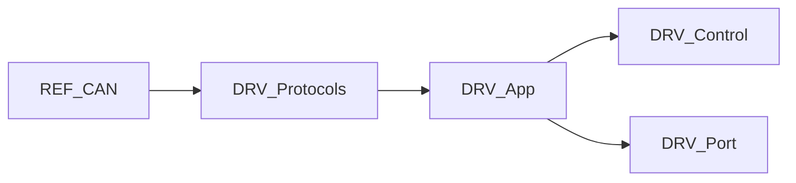

# DRV-App 详细设计

## 1. 模块定位

Ctrl-Step 关节驱动固件的**应用入口**：加载 `BoardConfig_t`、组装 Motor/驱动/编码器、启动 20kHz / 100Hz 定时器，并处理按键与配置提交。

**代码路径**：[`2.Firmware/Ctrl-Step-Driver-STM32F1-fw/UserApp/`](../../2.Firmware/Ctrl-Step-Driver-STM32F1-fw/UserApp/)

## 2. 在总体架构中的位置

对应总体架构中每个关节 MCU 的应用编排层；协议在 [DRV-Protocols](DRV-Protocols.md)，控制律在 [DRV-Control](DRV-Control.md)。



| 方向 | 邻居模块 | 交互内容 |
|------|----------|----------|
| 上游 | Cube `main.c` | 调用 `Main()` |
| 并列 | [DRV-Protocols](DRV-Protocols.md) | `OnCanCmd` / `OnUartCmd` 改 `motor` 状态 |
| 下游 | [DRV-Control](DRV-Control.md) | `Motor`、校准器 Tick |
| 下游 | [DRV-Port](DRV-Port.md) | EEPROM、STM32 外设绑定 |

## 3. 内部结构

```text
UserApp/
├── main.cpp                 # Main()、TIM 回调、全局对象
├── configurations.h         # BoardConfig_t
└── protocols/               # → DRV-Protocols.md
```

| 文件 | 职责 |
|------|------|
| `main.cpp` | 启动、ISR 回调、主循环配置提交 |
| `configurations.h` | 掉电保存的板级配置结构 |
| `protocols/` | CAN/UART 从站 |

## 4. 关键类与入口

### 全局对象

`BoardConfig_t boardConfig`、`Motor motor`、`TB67H450 tb67H450`、`MT6816 mt6816`、`EncoderCalibrator encoderCalibrator`、`Button button1/button2`、`Led statusLed`

### 定时器

| 定时器 | 频率 | 回调 | 职责 |
|--------|------|------|------|
| TIM4 | **20 kHz** | `Tim4Callback20kHz` | 校准 `Tick20kHz` 或 `motor.Tick20kHz()` |
| TIM1 | **100 Hz** | `Tim1Callback100Hz` | 按键 / LED Tick |

## 5. 核心行为 / 数据流

**`Main()` 顺序**：

1. `GetSerialNumber()` → 映射默认 NodeID（J1~J6 = 1~6）
2. `EEPROM::get(0, boardConfig)`；无效则写默认并 `put`
3. 同步到 `motor.config` / `motionPlanner`
4. `AttachDriver` / `AttachEncoder` → 各 `Init()`
5. 按键事件监听
6. 启动 TIM1 / TIM4 中断
7. 双键按下 → `encoderCalibrator.isTriggered = true`
8. 主循环：`encoderCalibrator.TickMainLoop()`；处理 `CONFIG_COMMIT` / `CONFIG_RESTORE`

## 6. 对外接口

本模块通过全局 `motor` / `boardConfig` 供协议层读写；不直接对 PC 暴露接口（经 CAN/UART）。

按键行为摘要（与 README 一致）：

- 双键上电：重新校准编码器
- 短按按键1：使能/失能闭环
- 长按按键1：重启
- 短按按键2：清堵转保护
- 长按按键2：目标归零

## 7. 配置与约束

### `BoardConfig_t` 字段

`configStatus`、`canNodeId`、`encoderHomeOffset`、`defaultMode`、`currentLimit`、`velocityLimit`、`velocityAcc`、`calibrationCurrent`、`dce_kp/kv/ki/kd`、`enableMotorOnBoot`、`enableStallProtect`

`configStatus_t`：`CONFIG_RESTORE` / `CONFIG_OK` / `CONFIG_COMMIT`

## 8. 二次开发要点

- **优先修改**：默认 PID/限流、按键逻辑、上电自动使能策略
- **不宜改动**：在 20kHz ISR 内做阻塞或 printf
- NodeID 与机械臂关节编号必须一一对应

## 9. 相关文档

- [系统架构](../ARCHITECTURE_CN.md) §3.3、§5.4
- [设计文档索引](README.md)
- [DRV-Control](DRV-Control.md) · [DRV-Port](DRV-Port.md) · [DRV-Protocols](DRV-Protocols.md)
