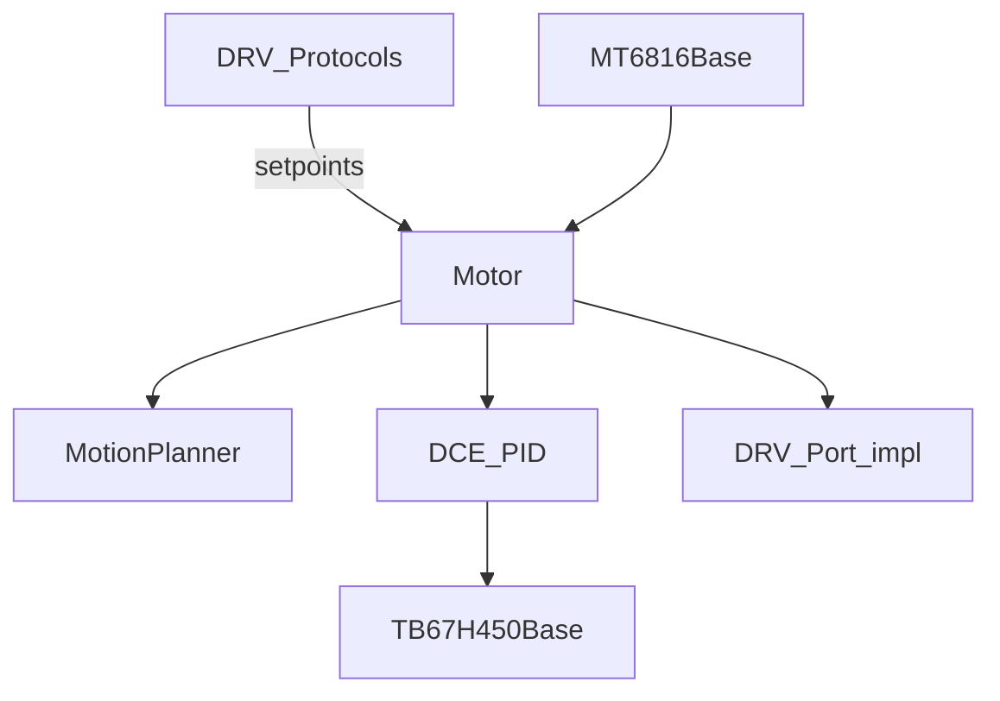

# DRV-Control 详细设计

## 1. 模块定位

Ctrl-Step **平台无关控制逻辑**：电机状态机、梯形/轨迹规划、DCE/PID 闭环、驱动芯片与编码器抽象、按键/LED 信号基类。

**代码路径**：[`2.Firmware/Ctrl-Step-Driver-STM32F1-fw/Ctrl/`](../../2.Firmware/Ctrl-Step-Driver-STM32F1-fw/Ctrl/)

## 2. 在总体架构中的位置

对应总体架构中关节侧 **20kHz 闭环**：上层 CAN 只更新设定点，高频控制在本地完成。



| 方向 | 邻居模块 | 交互内容 |
|------|----------|----------|
| 上游 | [DRV-App](DRV-App.md) / [DRV-Protocols](DRV-Protocols.md) | 模式切换、设定点、配置 |
| 下游 | [DRV-Port](DRV-Port.md) | `TB67H450`、`MT6816`、校准器、按键/LED 的 STM32 实现 |

## 3. 内部结构

```text
Ctrl/
├── Motor/
│   ├── motor.{h,cpp}              # Motor、Controller、DCE/PID
│   └── motion_planner.{h,cpp}     # 轨迹/跟踪子模块
├── Driver/
│   ├── driver_base.*
│   ├── tb67h450_base.*
│   └── sin_map.*
├── Sensor/Encoder/
│   ├── encoder_base.*
│   ├── mt6816_base.*
│   └── encoder_calibrator_base.*
└── Signal/
    ├── button_base.*
    └── led_base.*
```

## 4. 关键类与入口

| 类 | 说明 |
|----|------|
| `Motor` | 核心对象；`Tick20kHz()`：读编码器 → `CloseLoopControlTick()` |
| `Motor::Controller` | 模式 / 状态 / DCE / PID / 设定点 |
| `MotionPlanner` | `CONTROL_FREQUENCY=20000`；Current/Velocity/Position/Trajectory Tracker 等 |
| `DriverBase` / `TB67H450Base` | FOC 电流矢量、Sleep/Brake |
| `EncoderBase` / `MT6816Base` | 角度、`RESOLUTION=16384` |
| `EncoderCalibratorBase` | 上电/触发校准流程 |
| `ButtonBase` / `LedBase` | 按键事件；LED 按 `Motor::State_t` 显示 |

### 模式与状态

- **Mode**：`MODE_STOP`、`MODE_COMMAND_POSITION/VELOCITY/CURRENT`、`MODE_COMMAND_Trajectory`、`MODE_PWM_*`、`MODE_STEP_DIR`
- **State**：`STATE_STOP/FINISH/RUNNING/OVERLOAD/STALL/NO_CALIB`

### 分辨率常量

`MOTOR_ONE_CIRCLE_HARD_STEPS=200`，`SOFT_DIVIDE_NUM=256` → 细分步 `51200`/圈。

## 5. 核心行为 / 数据流

```text
Tick20kHz()
  → encoder->UpdateAngle()
  → CloseLoopControlTick()
       位置/轨迹/步进 → CalcDceToOutput(softPos, softVel)
       速度           → CalcPidToOutput(softVel)
       电流           → CalcCurrentToOutput(softCurrent)
  → driver->SetFocCurrentVector(...)
```

DCE：位置误差 + 速度误差 → `dce.output` → 电流输出。参数 `kp/kv/ki/kd` 可由 CAN 写入并可选存 EEPROM。

## 6. 对外接口

对 App/Protocols 暴露的主要是 `Motor` 成员：

- 模式切换与 `Set*SetPoint`
- `config` / DCE 参数
- `controller->state`（到位 FINISH 等，供 CAN 0x23 上报）

## 7. 配置与约束

- 控制频率固定与 TIM4 **20kHz** 对齐；改频率需同步改 `MotionPlanner::CONTROL_FREQUENCY` 与定时器
- 堵转保护、过载状态影响使能与 LED
- 未校准（`NO_CALIB`）时不应正常闭环运行

## 8. 二次开发要点

- **优先修改**：DCE 默认增益、轨迹规划策略、堵转判定
- **不宜改动**：在未理解单位（圈、r/s、mA）时混用设定点量纲
- 硬件相关实现放 Port，保持 Ctrl 可移植（项目设计目标）

## 9. 相关文档

- [系统架构](../ARCHITECTURE_CN.md) §3.3、§5.4
- [设计文档索引](README.md)
- [DRV-App](DRV-App.md) · [DRV-Port](DRV-Port.md) · [DRV-Protocols](DRV-Protocols.md)
- 参考项目：[unlir/XDrive](https://github.com/unlir/XDrive)
