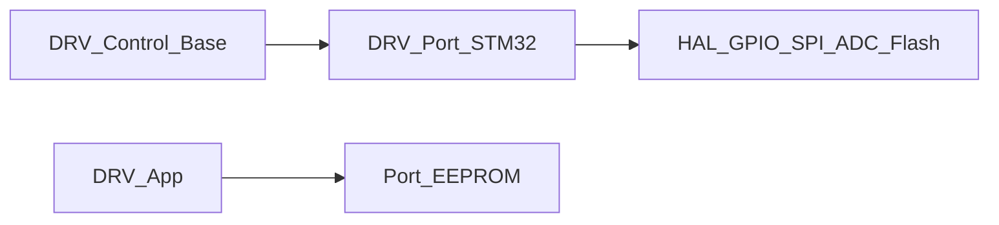

# DRV-Port 详细设计

## 1. 模块定位

Ctrl-Step 的 **STM32 移植层**：将 Ctrl 抽象类绑定到 F103 外设，并提供 Flash 模拟 EEPROM / 校准数据分区与工具函数。

**代码路径**：[`2.Firmware/Ctrl-Step-Driver-STM32F1-fw/Port/`](../../2.Firmware/Ctrl-Step-Driver-STM32F1-fw/Port/)

## 2. 在总体架构中的位置

位于控制逻辑与芯片外设之间，使 `Ctrl/` 保持平台无关。



| 方向 | 邻居模块 | 交互内容 |
|------|----------|----------|
| 上游 | [DRV-Control](DRV-Control.md) | 基类虚函数实现 |
| 上游 | [DRV-App](DRV-App.md) | `EEPROM::get/put`、`GetSerialNumber` |
| 下游 | Cube HAL / Flash | 引脚、定时器、SPI、Flash 擦写 |

## 3. 内部结构

```text
Port/
├── tb67h450_stm32.*
├── mt6816_stm32.*
├── encoder_calibrator_stm32.*
├── button_stm32.*
├── led_stm32.*
└── Platform/
    ├── Memory/
    │   ├── eeprom_interface.h
    │   ├── emulated_eeprom.*
    │   └── stockpile_*.h        # Flash 分区
    ├── Utils/st_hardware.*      # GetSerialNumber
    └── retarget.*               # printf
```

| 子路径 | 职责 |
|--------|------|
| `*_stm32.*` | 驱动/编码器/按键/LED/校准器板级实现 |
| `Platform/Memory/` | 模拟 EEPROM + 校准/用户数据地址 |
| `Platform/Utils/` | 芯片序列号等 |
| `retarget.*` | 标准输出重定向 |

## 4. 关键类与入口

| 类 / API | 说明 |
|----------|------|
| `TB67H450` | 继承 `TB67H450Base`，绑斩波驱动引脚 |
| `MT6816` | 继承 `MT6816Base`；校准表指针见下 |
| `EncoderCalibrator` | 板级校准流程 |
| `Button` / `Led` | GPIO 实现 |
| `EEPROM` | `get` / `put` 模板读写 `BoardConfig_t` |
| `GetSerialNumber()` | 用于默认 NodeID 映射 |

## 5. 核心行为 / 数据流

### Flash 分区（`stockpile_config.h`）

| 用途 | 地址 | 大小（约） |
|------|------|------------|
| 校准数据 | `STOCKPILE_APP_CALI_ADDR = 0x08017C00` | 32K |
| 用户数据 / EEPROM | `STOCKPILE_APP_DATA_ADDR = 0x0801FC00` | 1K |

- `MT6816` 构造传入 `(uint16_t*)0x08017C00` 作为校准表基址
- `EEPROM::put` 默认 `_commitASAP=true` → 立即 `eeprom_buffer_flush()`

### 配置提交（与 App 配合）

协议层将 `boardConfig.configStatus` 置为 `CONFIG_COMMIT` / `CONFIG_RESTORE`；App 主循环落盘或恢复默认。

## 6. 对外接口

对 Ctrl/App 暴露的是具体派生类实例与 `EEPROM` / `GetSerialNumber` API；不直接暴露协议。

## 7. 配置与约束

- 分区地址依赖当前 Flash 布局与链接脚本；移植其它 MCU 必须重算
- 频繁 commit 会磨损 Flash；批量改参时应聚合写入
- 校准数据损坏会导致 `NO_CALIB` / 运行异常，需双键重新校准

## 8. 二次开发要点

- **优先修改**：引脚映射、EEPROM 字段扩展（同步改 `BoardConfig_t` 与版本兼容策略）
- **不宜改动**：在未备份校准数据时擦除 `0x08017C00` 区域
- 新平台移植：实现 Port 派生类即可复用 Ctrl

## 9. 相关文档

- [系统架构](../ARCHITECTURE_CN.md) §3.3
- [设计文档索引](README.md)
- [DRV-App](DRV-App.md) · [DRV-Control](DRV-Control.md) · [DRV-Protocols](DRV-Protocols.md)
