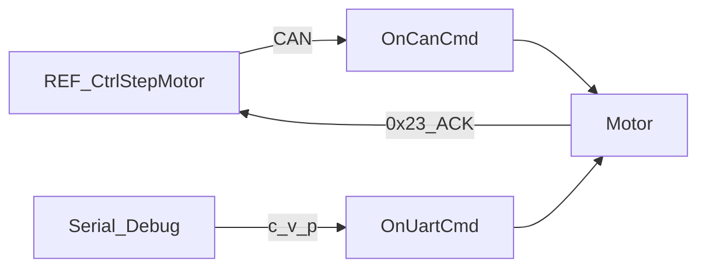

# DRV-Protocols 详细设计

## 1. 模块定位

Ctrl-Step **从站协议**：解析 CAN 标准帧与 UART 文本命令，更新电机设定点/参数，并回传电流、速度、位置等查询结果。与 REF 侧 [`CtrlStepMotor`](REF-Robot.md) 命令码一一对应。

**代码路径**：[`2.Firmware/Ctrl-Step-Driver-STM32F1-fw/UserApp/protocols/`](../../2.Firmware/Ctrl-Step-Driver-STM32F1-fw/UserApp/protocols/)

## 2. 在总体架构中的位置

对应总体架构 **REF ↔ 关节 CAN** 与单电机 UART 调试路径。



| 方向 | 邻居模块 | 交互内容 |
|------|----------|----------|
| 上游 | CAN/UART HAL | `OnCanCmd` / `OnUartCmd` 注册 |
| 下游 | [DRV-Control](DRV-Control.md) | 模式、设定点、DCE |
| 下游 | [DRV-App](DRV-App.md) | `boardConfig`、`CONFIG_COMMIT` |
| 对端 | [REF-Robot](REF-Robot.md) / [REF-Protocols](REF-Protocols.md) | 命令码与 ACK |

## 3. 内部结构

```text
UserApp/protocols/
├── interface_can.cpp     # OnCanCmd
└── interface_uart.cpp    # OnUartCmd
```

| 文件 | 职责 |
|------|------|
| `interface_can.cpp` | 总线控制与参数/查询 |
| `interface_uart.cpp` | 单机调试 `c/v/p` |

帧过滤（`can.c`）：`StdId` 高 4 位 = node id，低 7 位 = cmd；仅当 `id==0`（广播）或 `id==canNodeId` 时处理。

## 4. 关键类与入口

| 符号 | 说明 |
|------|------|
| `OnCanCmd(...)` | CAN 命令主入口 |
| `OnUartCmd(...)` | UART 行命令；由 `Uart_SetRxCpltCallBack` 注册 |

## 5. 核心行为 / 数据流

### CAN 命令分组（摘要）

| 范围 | 示例 | 行为 |
|------|------|------|
| 0x01~0x07 | 使能、校准、电流/速度/位置、限速位置 | 即时设定；0x05/0x07 可/必 ACK |
| 0x11~0x1B | NodeID、限流限速、加速度、Home、DCE、堵转 | 可选 `CONFIG_COMMIT`（`_data[4]`） |
| 0x21~0x24 | 查电流/速度/位置/offset | 同 cmd 回包 |
| 0x7e / 0x7f | 恢复配置 / 复位 | `CONFIG_RESTORE` / `NVIC_SystemReset` |

REF 运动主路径使用 **0x07**（位置 + 速度限制），到位反馈 **0x23**。全表见 [ARCHITECTURE §4.4](../ARCHITECTURE_CN.md)。

### UART

| 格式 | 模式 |
|------|------|
| `c %f` | 电流 |
| `v %f` | 速度 |
| `p %f` | 位置 |

用于单驱动调试，**不经过 REF**。

## 6. 对外接口

对外即 CAN/UART 命令集；单位约定：

- 电流：主机侧 float A，驱动内常转 mA
- 速度：float r/s（转子圈/秒量级，与 REF `CtrlStepMotor` 换算一致）
- 位置：float 圈数；REF 侧按角度/减速比换算

## 7. 配置与约束

- Node0 广播用于全体使能/重启/读角/设 Home 等
- 改 NodeID 后必须与机械安装位置一致，并写入 EEPROM
- UART 与 CAN 同时可用；量产主路径为 CAN

## 8. 二次开发要点

- **优先修改**：新增 cmd 时**同时**改本文件与 REF `ctrl_step.cpp`
- **不宜改动**：单独改一端命令码导致静默失败
- 带 EEPROM 的参数命令需明确 `_data[4]` 保存语义

## 9. 相关文档

- [系统架构](../ARCHITECTURE_CN.md) §4.4
- [设计文档索引](README.md)
- [DRV-App](DRV-App.md) · [DRV-Control](DRV-Control.md) · [REF-Robot](REF-Robot.md) · [REF-Protocols](REF-Protocols.md)
