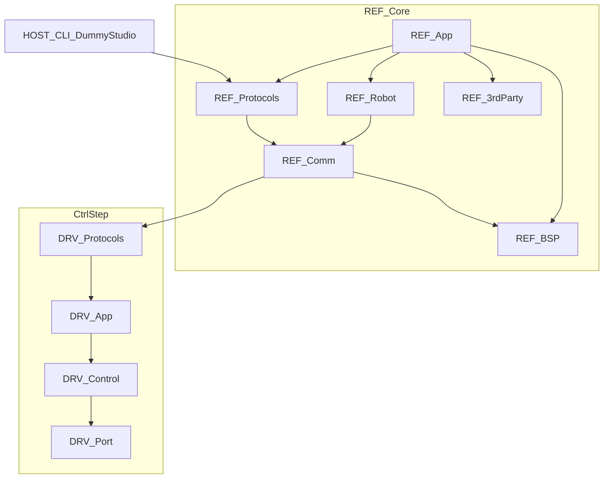

# 模块详细设计文档索引

> 本文档集展开各代码模块的设计架构与功能，并标明其在总体架构中的位置。  
> **系统总览**请先阅读：[ARCHITECTURE_CN.md](../ARCHITECTURE_CN.md)  
> **网络入门**（协议理论小白向）：[NETWORK_ARCHITECTURE_LEARNING_CN.md](../NETWORK_ARCHITECTURE_LEARNING_CN.md)  
> **上手指南**：[PROJECT_GUIDE_CN.md](../../PROJECT_GUIDE_CN.md)

## 文档与架构的分工

| 文档层 | 职责 |
|--------|------|
| [`NETWORK_ARCHITECTURE_LEARNING_CN.md`](../NETWORK_ARCHITECTURE_LEARNING_CN.md) | 从零理解分层、UART/USB/CAN、ASCII/Fibre，以及一条指令如何走完全机 |
| [`ARCHITECTURE_CN.md`](../ARCHITECTURE_CN.md) | 系统怎么拼：角色、跨模块时序、协议全表、术语 |
| `design/*.md`（本文档集） | 这一块代码怎么写：入口、类、目录、二次开发点 |

协议命令全表、DH 参数、FreeRTOS 任务总表以架构文档为准；模块文只写本模块相关子集并回链。

## 模块在总体架构中的位置

## 文档列表

### REF 核心固件（`2.Firmware/Core-STM32F4-fw/`）

| 文档 | 代码路径 | 说明 |
|------|----------|------|
| [REF-App.md](REF-App.md) | `UserApp/` | 应用入口、任务、TIM7 200Hz、OLED/IMU |
| [REF-Robot.md](REF-Robot.md) | `Robot/` | DummyRobot、运动学、执行器、指令模式 |
| [REF-Comm.md](REF-Comm.md) | `Bsp/communication/` | USB/UART/CAN 通信基础设施 |
| [REF-Protocols.md](REF-Protocols.md) | `UserApp/protocols/` | Fibre / ASCII / CAN 协议扩展 |
| [REF-BSP.md](REF-BSP.md) | `Bsp/{imu,gpio,memory,utils}/` | 板载外设与工具 |
| [REF-3rdParty.md](REF-3rdParty.md) | `3rdParty/fibre`、`u8g2` | 第三方库集成点 |

### Ctrl-Step 驱动固件（`2.Firmware/Ctrl-Step-Driver-STM32F1-fw/`）

| 文档 | 代码路径 | 说明 |
|------|----------|------|
| [DRV-App.md](DRV-App.md) | `UserApp/` | 启动、定时器、BoardConfig、按键 |
| [DRV-Control.md](DRV-Control.md) | `Ctrl/` | Motor、MotionPlanner、DCE、驱动/编码器 |
| [DRV-Port.md](DRV-Port.md) | `Port/` | STM32 绑定、模拟 EEPROM |
| [DRV-Protocols.md](DRV-Protocols.md) | `UserApp/protocols/` | CAN / UART 从站协议 |

### 上位机（`3.Software/`）

| 文档 | 代码路径 | 说明 |
|------|----------|------|
| [HOST-CLI-Tool.md](HOST-CLI-Tool.md) | `CLI-Tool/` | fibre / ref_tool 架构与用法 |
| [HOST-DummyStudio.md](HOST-DummyStudio.md) | `DummyStudio/` | Unity 预编译上位机（无源码） |

## 不单独成册的目录

- `Core/`、`Drivers/`、`Middlewares/`、`USB_DEVICE/`、`startup/` — CubeMX / HAL 生成物
- `3rdParty/u8g2/` 下大量显示驱动 `.c` — 仅在 [REF-3rdParty.md](REF-3rdParty.md) 说明集成点
- IDE 配置（`.idea/` 等）

## 模板

新建模块文档请复制 [_TEMPLATE.md](_TEMPLATE.md)。
