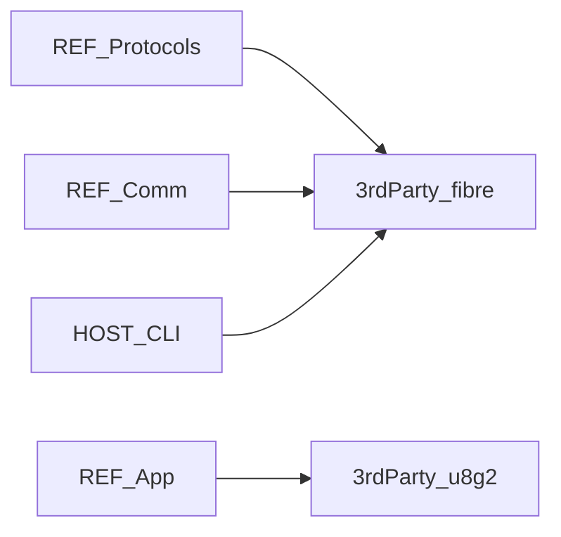

# REF-3rdParty 详细设计

## 1. 模块定位

REF 固件对**第三方库**的集成说明：Fibre（对象协议栈）与 u8g2（OLED 图形）。本文只描述集成点与依赖关系，不文档化 vendor 全量源码。

**代码路径**：[`2.Firmware/Core-STM32F4-fw/3rdParty/`](../../2.Firmware/Core-STM32F4-fw/3rdParty/)

## 2. 在总体架构中的位置

Fibre 支撑 PC↔REF 的对象树通信；u8g2 支撑板载显示。二者由 App / Comm / Protocols 调用。



| 方向 | 邻居模块 | 交互内容 |
|------|----------|----------|
| 上游 | [REF-Protocols](REF-Protocols.md) / [REF-Comm](REF-Comm.md) | `fibre_publish`、编解码 |
| 上游 | [REF-App](REF-App.md) | `SSD1306` / U8g2 C++ 封装 |
| 对端 | [HOST-CLI-Tool](HOST-CLI-Tool.md) | PC 侧 `fibre/` 包与之对偶 |

## 3. 内部结构

```text
3rdParty/
├── fibre/
│   └── cpp/              # protocol.hpp/cpp 等 C++ 协议栈
└── u8g2/                 # C 驱动全集 + cpp/U8g2lib.hpp 封装
```

| 子路径 | 职责 |
|--------|------|
| `fibre/cpp/` | Endpoint、对象树、流式/包式协议（源自 ODrive 生态） |
| `u8g2/` | 多芯片 OLED 驱动；项目实际用 SSD1306 I2C |
| `u8g2/cpp/U8g2lib.hpp` | C++ 封装；`SSD1306` 类 |

## 4. 关键类与入口

| 符号 | 位置 | 说明 |
|------|------|------|
| Fibre 发布 / 编解码 | `fibre/cpp/protocol.*` | 由 `CommitProtocol`、USB/UART server 使用 |
| `SSD1306` | `u8g2/cpp/U8g2lib.hpp` | `SSD1306(I2C_HandleTypeDef*, rotation)`；`Init()` |
| u8g2 绘图 API | u8g2 C API | OLED 线程中画关节/位姿/模式 |

## 5. 核心行为 / 数据流

### Fibre

```text
MakeObjTree() → CommitProtocol / fibre_publish
  → USB Native / UART 传输层收发包
  → 属性读写映射到 DummyRobot 方法
```

### u8g2 / OLED

```text
SSD1306(&hi2c0) → Init()（可走 soft_i2c）
  → ThreadOledUpdate 循环刷新
```

## 6. 对外接口

- Fibre：对二次开发暴露的是 **对象树定义**（在 Protocols / Robot 的 `MakeProtocolDefinitions`），而非直接改 fibre 内核
- u8g2：通过 `SSD1306` / U8g2 绘图 API 使用

## 7. 配置与约束

- Fibre 与 ODrive / CLI-Tool 版本需保持协议兼容；乱改 endpoint 布局会导致上位机连不上
- u8g2 目录体量大：新增其它屏型号时才需关心对应 `.c` 驱动
- 官方说明：软 I2C 驱动屏幕实测帧率可优于有问题的硬件 I2C

## 8. 二次开发要点

- **优先修改**：对象树挂接（Protocols/Robot）；OLED 绘制内容（App）
- **不宜改动**：fibre 核心编解码、u8g2 上游驱动文件（升级时整体替换更安全）
- 上游参考：[odriverobotics/ODrive](https://github.com/odriverobotics/ODrive)、[fibre](https://github.com/samuelsadok/fibre)、[olikraus/u8g2](https://github.com/olikraus/u8g2)

## 9. 相关文档

- [系统架构](../ARCHITECTURE_CN.md) §4.2、§8.3
- [设计文档索引](README.md)
- [REF-Protocols](REF-Protocols.md) · [REF-Comm](REF-Comm.md) · [REF-App](REF-App.md) · [HOST-CLI-Tool](HOST-CLI-Tool.md)
