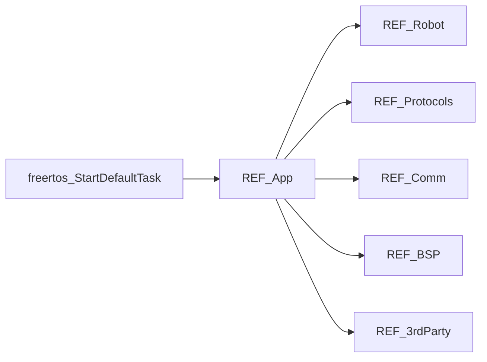

# REF-App 详细设计

## 1. 模块定位

REF 核心固件的**应用层入口**：创建用户线程、绑定板载外设实例、驱动 200Hz 控制环，并调用 Robot / 通信 / 协议模块完成整机运行。

**代码路径**：[`2.Firmware/Core-STM32F4-fw/UserApp/`](../../2.Firmware/Core-STM32F4-fw/UserApp/)

## 2. 在总体架构中的位置

对应总体架构中 **REF_Core** 的应用编排层：上接 FreeRTOS 默认任务，下驱运动学与执行器，旁路驱动 OLED/IMU，并依赖通信栈与协议扩展。



| 方向 | 邻居模块 | 交互内容 |
|------|----------|----------|
| 上游 | Cube FreeRTOS（`Core/Src/freertos.c`） | `StartDefaultTask` → `Main()` |
| 下游 | [REF-Robot](REF-Robot.md) | `dummy.Init()`、控制环调用 MoveJoints / FK |
| 下游 | [REF-Comm](REF-Comm.md) | `InitCommunication()` |
| 并列 | [REF-Protocols](REF-Protocols.md) | 协议回调使用全局 `dummy` |
| 下游 | [REF-BSP](REF-BSP.md) / [REF-3rdParty](REF-3rdParty.md) | Timer、PWM、MPU6050、SSD1306 |

## 3. 内部结构

```text
UserApp/
├── main.cpp              # Main()、三用户线程、TIM7 回调、全局实例
├── common_inc.h          # 公共 include 与 CONFIG_FW_VERSION
└── protocols/            # 见 REF-Protocols.md
```

| 文件 | 职责 |
|------|------|
| `main.cpp` | 应用生命周期、任务模型、外设实例 |
| `common_inc.h` | C/C++ 聚合头、版本号、`serialNumber` 声明 |
| `protocols/` | Fibre / ASCII / CAN 扩展（独立文档） |

## 4. 关键类与入口

### 全局实例（`main.cpp`）

| 变量 | 类型 | 绑定 |
|------|------|------|
| `oled` | `SSD1306` | `&hi2c0`（软件 I2C） |
| `mpu6050` | `MPU6050` | `&hi2c1` |
| `timerCtrlLoop` | `Timer` | `&htim7`，**200 Hz** |
| `pwm` | `PWM` | TIM9 + TIM12，`(21000, 21000)` |
| `dummy` | `DummyRobot` | `&hcan1` |

### 用户线程

| 线程 | 优先级 | 行为 |
|------|--------|------|
| `ThreadControlLoopFixUpdate` | Realtime | `ulTaskNotifyTake`；使能时按 `commandMode` 执行 `MoveJoints` / `TuningHelper::Tick` + `UpdateJointPose6D`；禁用时读角 + FK |
| `ThreadControlLoopUpdate` | Normal | 循环 `commandHandler.ParseCommand(Pop)` |
| `ThreadOledUpdate` | Normal | `mpu6050.Update` + OLED 刷新关节/位姿/模式 |

### 定时器

- `OnTimer7Callback()`：ISR 内 `vTaskNotifyGiveFromISR(controlLoopFixUpdateHandle)`，实现 **200Hz** 固定控制环唤醒。

## 5. 核心行为 / 数据流

**入口链**：

```text
Core/Src/main.c
  → FreeRTOS
  → freertos.c: StartDefaultTask
       → MX_USB_DEVICE_Init()
       → UserApp/main.cpp: Main()
       → vTaskDelete(defaultTaskHandle)
```

**`Main()` 初始化顺序**：

1. `InitCommunication()` — 阻塞至 Fibre 端点就绪
2. `dummy.Init()` — 默认指令模式与关节速度
3. IMU：循环 `mpu6050.Init()` 直至 `testConnection()`；`InitFilter(200, 100, 50)`
4. `oled.Init()`
5. `pwm.Start()`
6. 创建三用户线程
7. `timerCtrlLoop.SetCallback(OnTimer7Callback); Start()`
8. 打印堆信息；PWM 点亮开关指示 LED

## 6. 对外接口

本模块不对外暴露独立协议 API；对外能力通过：

- 全局 `dummy`（供 [REF-Protocols](REF-Protocols.md) 回调）
- OLED / IMU 线程（状态展示）
- 200Hz 控制环（驱动 [REF-Robot](REF-Robot.md)）

任务总表见 [ARCHITECTURE §5.2](../ARCHITECTURE_CN.md)。

## 7. 配置与约束

- `CONFIG_FW_VERSION`：`1.0`（`common_inc.h`）
- `serialNumber` / `serialNumberStr`：由 `Core/Src/main.c` 从 STM32 UUID 生成
- **遗留**：`common_inc.h` 仍 `#include "actuators/mintasca/sca.hpp"`，仓库中该路径不存在，可能导致编译失败；主执行器路径为 `Robot/actuators/ctrl_step/`。二次开发需删除该 include 或补回源码。

## 8. 二次开发要点

- **优先修改**：`main.cpp` 中任务逻辑、TIM7 频率、OLED 显示内容、外设绑定
- **不宜改动**：在 TIM7 ISR 内做重计算（应保持 Notify 模式）
- 新增板载功能：先在 [REF-BSP](REF-BSP.md) 封装，再在本模块实例化

## 9. 相关文档

- [系统架构](../ARCHITECTURE_CN.md)
- [设计文档索引](README.md)
- [REF-Robot](REF-Robot.md) · [REF-Comm](REF-Comm.md) · [REF-Protocols](REF-Protocols.md) · [REF-BSP](REF-BSP.md)
