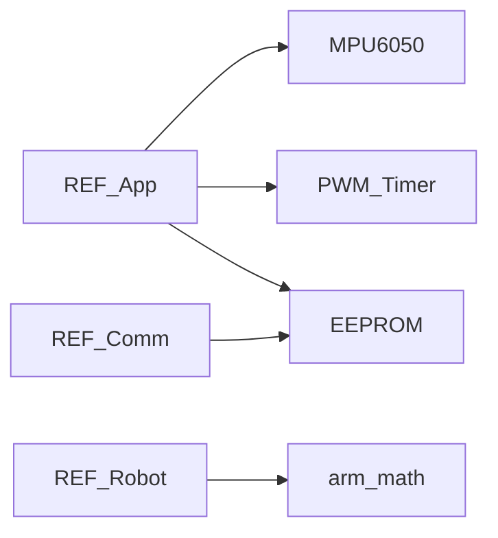

# REF-BSP 详细设计

## 1. 模块定位

REF 板级支持包中**非通信**部分：IMU、GPIO/PWM、模拟 EEPROM、软件定时器与数学工具，供 [REF-App](REF-App.md) 与其它层使用。

**代码路径**：[`2.Firmware/Core-STM32F4-fw/Bsp/`](../../2.Firmware/Core-STM32F4-fw/Bsp/)（不含 `communication/`，见 [REF-Comm](REF-Comm.md)）

## 2. 在总体架构中的位置

位于 REF 硬件抽象层：支撑人机显示、姿态传感、指示灯与掉电存储，不直接参与运动学或 CAN 协议。



| 方向 | 邻居模块 | 交互内容 |
|------|----------|----------|
| 上游 | [REF-App](REF-App.md) | 实例化 MPU6050、Timer、PWM、OLED 依赖软 I2C |
| 并列 | [REF-Comm](REF-Comm.md) | 同属 Bsp；通信独立成册 |
| 下游 | HAL I2C/TIM/ADC/Flash | 寄存器级操作 |

## 3. 内部结构

```text
Bsp/
├── imu/                 # MPU6050、I2Cdev、biquad 滤波、DMP 头（未主用）
├── gpio/                # PWM、Encoder、Analog
├── memory/              # EEPROMClass / emulated_eeprom
├── utils/               # Timer、time_utils、soft_i2c、arm_math
└── communication/       # → REF-Comm.md
```

| 子路径 | 职责 |
|--------|------|
| `imu/` | MPU6050 驱动与低通滤波 |
| `gpio/` | PWM、正交编码器抽象、ADC 辅助 |
| `memory/` | Flash 模拟 EEPROM |
| `utils/` | 软件定时器、micros/millis、软 I2C、CMSIS-DSP |

## 4. 关键类与入口

| 类 / 模块 | 路径 | 要点 |
|-----------|------|------|
| `MPU6050` | `imu/MPU6050.*` | `Init`、`testConnection`、`Update`、`InitFilter(rate, gyroCut, accCut)` |
| `BiquadFilter_t` | `imu/filters/` | 陀螺/加速度 LPF |
| `PWM` | `gpio/pwm.*` | TIM9 + TIM12；默认约 **21 kHz**；duty 0~1 |
| `Encoder` | `gpio/encoder.*` | 默认 CPR 4096 |
| `Analog` | `gpio/analog.*` | 芯片温度、通道电压 |
| `EEPROMClass` | `memory/` | `read/write/get/put/commit` |
| `Timer` | `utils/timer.*` | 绑定 TIM7/10/11/13/14；`SetCallback` + `Start` |
| `micros` / `millis` | `utils/time_utils.*` | OLED FPS 等 |
| `soft_i2c` | `utils/software_i2c/` | OLED 用 `hi2c0` |

## 5. 核心行为 / 数据流

### IMU（App 用法）

```text
循环 Init + testConnection
  → InitFilter(200, 100, 50)
  → Oled 线程中 Update(true)
```

### 控制环定时（App）

```text
Timer(&htim7) @ 200Hz
  → OnTimerCallback → vTaskNotifyGiveFromISR
```

### EEPROM

STM32F4 无片内 DATA_EEPROM：用 Flash 页模拟（页大小 1KB），`_commitASAP` 默认 true。

## 6. 对外接口

面向 App / Robot 的 C++ 类 API（见上表）。芯片温度亦通过 Fibre `get_temperature` 暴露（[REF-Protocols](REF-Protocols.md)）。

## 7. 配置与约束

- OLED 使用软件 I2C：硬件 I2C 在本项目中实测问题较多（官方说明）
- MPU6050 DMP 相关头文件存在但 **main 主路径未启用**
- `Encoder` / `Analog` 类已提供，是否在当前 Dummy 主路径全量使用需对照 App

## 8. 二次开发要点

- **优先修改**：滤波参数、PWM 通道映射、EEPROM 键布局
- **不宜改动**：在未评估 Flash 磨损前高频 `commit`
- 新增传感器：在本目录封装类，再于 App 实例化

## 9. 相关文档

- [系统架构](../ARCHITECTURE_CN.md) §3.2
- [设计文档索引](README.md)
- [REF-App](REF-App.md) · [REF-Comm](REF-Comm.md) · [REF-3rdParty](REF-3rdParty.md)
