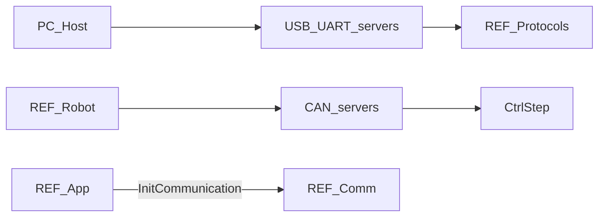

# REF-Comm 详细设计

## 1. 模块定位

REF 侧**通信基础设施**：初始化 Fibre 端点、拉起 USB / UART / CAN 服务任务，为协议层提供收发与 Stream 输出通道。

**代码路径**：[`2.Firmware/Core-STM32F4-fw/Bsp/communication/`](../../2.Firmware/Core-STM32F4-fw/Bsp/communication/)

## 2. 在总体架构中的位置

对应总体架构中 **PC ↔ REF** 与 **REF ↔ 关节** 的传输层；协议语义在 [REF-Protocols](REF-Protocols.md)，本模块负责通道与任务。



| 方向 | 邻居模块 | 交互内容 |
|------|----------|----------|
| 上游 | [REF-App](REF-App.md) | `InitCommunication()` |
| 并列 | [REF-Protocols](REF-Protocols.md) | ASCII 分发、`OnCanMessage`、`CommitProtocol` |
| 下游 | HAL USB/UART/CAN | DMA、中断、CDC / Native |
| 对端 | [HOST-CLI-Tool](HOST-CLI-Tool.md) | USB Fibre / 串口 |

## 3. 内部结构

```text
Bsp/communication/
├── communication.{hpp,cpp}     # InitCommunication、CommunicationTask
├── ascii_processor.{hpp,cpp}   # ASCII 行解析框架
├── interface_usb.{hpp,cpp}     # USB CDC + Native Fibre
├── interface_uart.{hpp,cpp}    # UART4/5 DMA 环缓
└── interface_can.{hpp,cpp}     # CAN 上下文与收发
```

| 文件 | 职责 |
|------|------|
| `communication.*` | 通信总任务、端点就绪标志 |
| `ascii_processor.*` | 按 `StreamSink::channelType` 分发到 USB/UART4/UART5 回调 |
| `interface_usb.*` | CDC ASCII + ODrive Native Fibre；IRQ 延迟任务 |
| `interface_uart.*` | UART4/5 双路 Fibre+ASCII；`UartServerTask` |
| `interface_can.*` | `CAN_context`、收发辅助；回调进协议层 |

## 4. 关键类与入口

| 符号 | 说明 |
|------|------|
| `InitCommunication()` | 创建 `CommunicationTask`（栈 **45000**），阻塞至 `endpointListValid` |
| `CommunicationTask` | `CommitProtocol()` → 置位端点 → `StartUartServer` / `StartUsbServer` / `StartCanServer(CAN1|CAN2)` |
| `UsbServerTask` | CDC + Native；`sem_usb_rx` |
| `UsbDeferredInterruptTask` | USB ISR 延迟（`MX_FREERTOS_Init` 创建） |
| `UartServerTask` | **1 ms** 轮询 NDTR |
| `OnCanMessage` | 定义在协议层，由 CAN HAL 回调触发 |

**全局 Stream 输出指针**：`usbStreamOutputPtr`、`uart4StreamOutputPtr`、`uart5StreamOutputPtr`。  
**printf**：`_write` 同时输出到 USB + UART4。

## 5. 核心行为 / 数据流

```text
InitCommunication()
  → CommunicationTask
       → CommitProtocol() / fibre_publish
       → endpointListValid = true   # Main() 解除阻塞
       → Start UART / USB / CAN1+CAN2
       → 空转 osDelay(1000)
```

- USB：CDC 走 ASCII；Native 走 Fibre packet
- UART4：ASCII + Fibre；UART5：通道预留
- CAN：无独立 FreeRTOS 任务；收包在 HAL 回调路径进入 `OnCanMessage`
- 超时常量：`PROTOCOL_SERVER_TIMEOUT_MS = 10`
- UART RX/TX 缓冲各 64 B；ASCII `MAX_LINE_LENGTH = 256`

## 6. 对外接口

| API / 符号 | 用途 |
|------------|------|
| `InitCommunication()` | App 启动必需 |
| Stream 输出指针 | Protocols / CommandHandler Respond |
| `StartCanServer` / CAN 发送辅助 | `CtrlStepMotor` 发帧 |
| ASCII 框架 | 调用 `OnUsbAsciiCmd` / `OnUart4AsciiCmd` / `OnUart5AsciiCmd` |

链路角色总览见 [ARCHITECTURE §4.1](../ARCHITECTURE_CN.md)。

## 7. 配置与约束

- `CommunicationTask` 栈 45000：承载 Fibre 对象树缓冲，勿盲目缩小
- CAN2 已启动，协议回调预留扩展
- 典型串口波特率 **115200**（上位机侧配置）

## 8. 二次开发要点

- **优先修改**：缓冲大小、超时、新增传输需在 `CommunicationTask` 启动路径注册
- **不宜改动**：在未理解 Fibre 生命周期前改动 `endpointListValid` 时序（会卡死 `Main()`）
- 协议命令本身改 [REF-Protocols](REF-Protocols.md)，不要塞进 interface 文件

## 9. 相关文档

- [系统架构](../ARCHITECTURE_CN.md) §4、§5.2
- [设计文档索引](README.md)
- [REF-App](REF-App.md) · [REF-Protocols](REF-Protocols.md) · [REF-Robot](REF-Robot.md)
