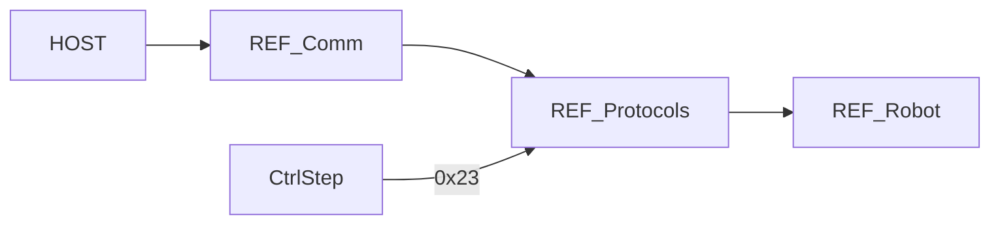

# REF-Protocols 详细设计

## 1. 模块定位

REF 侧**协议扩展层**：将 USB/UART/CAN 原始流映射为 Fibre 对象树、ASCII 命令与关节反馈回调，桥接主机工具与 [`DummyRobot`](REF-Robot.md)。

**代码路径**：[`2.Firmware/Core-STM32F4-fw/UserApp/protocols/`](../../2.Firmware/Core-STM32F4-fw/UserApp/protocols/)

## 2. 在总体架构中的位置

对应总体架构中 Host → Comm → **协议语义** → Robot 的中间层。



| 方向 | 邻居模块 | 交互内容 |
|------|----------|----------|
| 上游 | [REF-Comm](REF-Comm.md) | Stream / CAN 回调入口 |
| 下游 | [REF-Robot](REF-Robot.md) | 使能、MoveJ/L、读角、Fibre 属性 |
| 对端 | [HOST-CLI-Tool](HOST-CLI-Tool.md) / DummyStudio | Fibre / ASCII |
| 对端 | [DRV-Protocols](DRV-Protocols.md) | CAN 命令与 ACK |

## 3. 内部结构

```text
UserApp/protocols/
├── cmd_protocol.cpp      # Fibre MakeObjTree / CommitProtocol
├── ascii_protocol.cpp    # OnUsbAsciiCmd / OnUart4 / OnUart5
└── can_protocol.cpp      # OnCanMessage
```

| 文件 | 职责 |
|------|------|
| `cmd_protocol.cpp` | 根对象树、`get_temperature`、`robot` 子树挂接 |
| `ascii_protocol.cpp` | 文本命令解析与 Respond |
| `can_protocol.cpp` | 关节角度反馈分发 |

## 4. 关键类与入口

| 符号 | 文件 | 说明 |
|------|------|------|
| `MakeObjTree()` / `CommitProtocol()` | `cmd_protocol.cpp` | Fibre 发布；`COMMIT_PROTOCOL` 宏 |
| `HelperFunctions::GetTemperatureHelper` | 同上 | `AdcGetChipTemperature()` |
| `OnUsbAsciiCmd` / `OnUart4AsciiCmd` | `ascii_protocol.cpp` | USB CDC 与 UART4 逻辑一致 |
| `OnUart5AsciiCmd` | 同上 | **空实现**（预留） |
| `OnCanMessage` | `can_protocol.cpp` | CAN1 解析 NodeID/cmd；CAN2 占位 |

## 5. 核心行为 / 数据流

### Fibre

```text
CommunicationTask → CommitProtocol()
  → MakeObjTree()
       serial_number (RO)
       get_temperature()
       robot → dummy.MakeProtocolDefinitions()
```

### ASCII（USB / UART4）

| 前缀 / 条件 | 命令 | 动作 |
|-------------|------|------|
| `!` 或未使能 | `STOP` / `START` / `DISABLE` | 急停 / 使能 / 失能 |
| `#` | `GETJPOS` / `GETLPOS` / `CMDMODE` | 读关节 / 读位姿 / 设模式 |
| `>` / `@` | 后接参数 | `commandHandler.Push`，返回 FIFO 剩余 |

完整 ASCII 表见 [ARCHITECTURE §4.3](../ARCHITECTURE_CN.md)。

### CAN 反馈

- `StdId`：`id = StdId >> 7`，`cmd = StdId & 0x7F`
- `cmd == 0x23`：`motorJ[id]->UpdateAngleCallback` → `UpdateJointAnglesCallback()`

## 6. 对外接口

本模块是主机与 Robot 的**协议门面**：

- Fibre：供 CLI-Tool `ref0.robot.*`
- ASCII：供 DummyStudio / 串口调试 / RoboDK 类驱动
- CAN RX：供驱动 ACK

命令码全表以 [ARCHITECTURE §4](../ARCHITECTURE_CN.md) 为准。

## 7. 配置与约束

- UART5 ASCII 未实现自定义命令
- CAN2 接收回调为空，仅预留扩展
- ASCII 与 Fibre 可并存于同一 UART/USB 通道（由 Comm 层分流）

## 8. 二次开发要点

- **优先修改**：新增 ASCII → `ascii_protocol.cpp`；新增 Fibre 属性 → `cmd_protocol.cpp` + `DummyRobot::MakeProtocolDefinitions`；改 CAN 反馈语义 → `can_protocol.cpp` + `CtrlStepMotor`
- **不宜改动**：随意改 NodeID 位域打包（`<< 7`）而不改驱动端解析
- 运动语义应落在 Robot，协议层保持薄适配

## 9. 相关文档

- [系统架构](../ARCHITECTURE_CN.md) §4
- [设计文档索引](README.md)
- [REF-Comm](REF-Comm.md) · [REF-Robot](REF-Robot.md) · [DRV-Protocols](DRV-Protocols.md) · [HOST-CLI-Tool](HOST-CLI-Tool.md)
