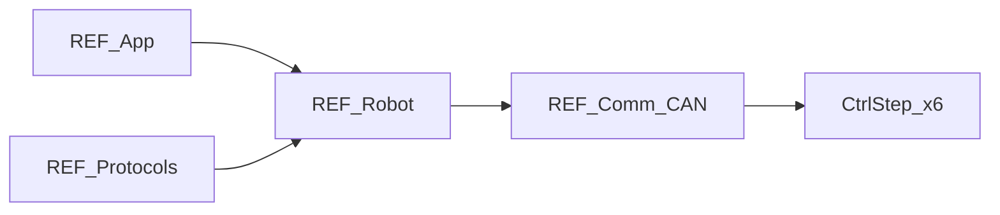

# REF-Robot 详细设计

## 1. 模块定位

REF 侧**整机机器人模型**：六轴 + 夹爪、DH 正逆解、指令 FIFO、关节 CAN 执行器封装，以及 MoveJ / MoveL 与多种指令模式。

**代码路径**：[`2.Firmware/Core-STM32F4-fw/Robot/`](../../2.Firmware/Core-STM32F4-fw/Robot/)

## 2. 在总体架构中的位置

对应总体架构图中 **Cmd → Kin → Loop → Act** 链路的主体：由 [REF-App](REF-App.md) 200Hz 环驱动，经 CAN 下发到关节驱动。



| 方向 | 邻居模块 | 交互内容 |
|------|----------|----------|
| 上游 | [REF-App](REF-App.md) | `Init`、`MoveJoints`、`UpdateJointPose6D`、指令解析线程 |
| 上游 | [REF-Protocols](REF-Protocols.md) | ASCII/Fibre 调用 MoveJ/L、使能、回零等 |
| 下游 | [REF-Comm](REF-Comm.md) | 经 `CtrlStepMotor` 发 CAN 帧 |
| 对端 | [DRV-Protocols](DRV-Protocols.md) | 命令码 0x01~0x7f 与反馈 0x23 |

## 3. 内部结构

```text
Robot/
├── instances/
│   └── dummy_robot.{h,cpp}       # DummyRobot、CommandHandler、TuningHelper、DummyHand 声明侧
├── algorithms/kinematic/
│   └── 6dof_kinematic.{h,cpp}    # DOF6Kinematic
└── actuators/ctrl_step/
    └── ctrl_step.{hpp,cpp}       # CtrlStepMotor、DummyHand 实现
```

| 子路径 | 职责 |
|--------|------|
| `instances/` | 整机对象、指令队列、指令模式、Fibre `robot` 子树定义 |
| `algorithms/kinematic/` | 传统 DH 正 / 逆解 |
| `actuators/ctrl_step/` | 单关节 / 夹爪 CAN 封装 |

## 4. 关键类与入口

| 类 | 文件 | 说明 |
|----|------|------|
| `DummyRobot` | `dummy_robot.*` | 持有 `motorJ[0..6]`、`hand`、`dof6Solver`、`commandHandler`、`tuningHelper` |
| `DummyRobot::CommandHandler` | 同上 | 深度 16 的 ASCII 指令 FIFO（`osMessageQueue`） |
| `DummyRobot::TuningHelper` | 同上 | 电机扫频调参（`COMMAND_MOTOR_TUNING`） |
| `DOF6Kinematic` | `6dof_kinematic.*` | FK / IK（最多 8 组解） |
| `CtrlStepMotor` | `ctrl_step.*` | 单关节 CAN；角度换算、限位、反向 |
| `DummyHand` | `ctrl_step.*` | 夹爪 CAN Node **7** |

### 关节构造摘要（ctor）

| 索引 | NodeID | 反向 | 减速比 | 限位 (deg) |
|------|--------|------|--------|------------|
| ALL | 0 | — | 1 | 广播 |
| J1~J6 | 1~6 | 见源码 | 50/30/30/24/30/50 | 见 `dummy_robot.cpp` |
| hand | 7 | — | — | 开合角 |

DH 连杆 (m)：`DOF6Kinematic(0.109, 0.035, 0.146, 0.115, 0.052, 0.072)` — 全表见 [ARCHITECTURE §2](../ARCHITECTURE_CN.md)。

### 指令模式 `CommandMode`

| 值 | 模式 | 行为要点 |
|----|------|----------|
| 1 | `COMMAND_TARGET_POINT_SEQUENTIAL` | 点到点，阻塞至到位后 Respond |
| 2 | `COMMAND_TARGET_POINT_INTERRUPTABLE` | **默认**；可中断，立即 Respond |
| 3 | `COMMAND_CONTINUES_TRAJECTORY` | 连续轨迹；较低速度比、高加速度 |
| 4 | `COMMAND_MOTOR_TUNING` | 200Hz 调用 `TuningHelper::Tick` |

## 5. 核心行为 / 数据流

### MoveJ

1. 限位检查 → 按最大关节角差估算时间 → 分配 `dynamicJointSpeeds`
2. 写入 `targetJoints`，清 `jointsStateFlag`
3. 200Hz：`MoveJoints()` → 各轴 `SetAngleWithVelocityLimit`（CAN **0x07**）
4. 驱动回 `0x23` → `UpdateAngleCallback` → 标志齐全视为到位

### MoveL

1. `SolveIK` → 过滤超限位 → 选相对当前姿态最大关节变化量最小的解
2. 转入 MoveJ 路径

### CommandHandler

- `Push` / `Pop`：队列 16×64B；失败返回 `0xFF`
- `ParseCommand`：`'>'` MoveJ，`'@'` MoveL（6 或 7 参数，第 7 为速度）
- `EmergencyStop`：目标改为当前位置 → 下发 → 失能 → 清 FIFO

### 运动学 API

- `SolveFK(Joint6D_t, Pose6D_t&)`：输出欧拉角 deg；App 侧 XYZ 再 ×1000 显示为 mm
- `SolveIK(Pose6D_t, Joint6D_t last, IKSolves_t&)`：输入 XYZ 按 mm→m（/1000）

## 6. 对外接口

### C++ API（供 App / Protocols）

`Init`、`SetEnable`、`MoveJ`/`MoveL`、`MoveJoints`、`UpdateJointAngles`、`UpdateJointPose6D`、`Homing`/`Resting`、`CalibrateHomeOffset`、`Reboot`、`SetCommandMode`、`SetJointSpeed`/`SetJointAcc` 等。

### Fibre `robot` 子树（摘要）

`calibrate_home_offset`、`homing`、`resting`、`joint_1..6`、`joint_all`、`hand`、`reboot`、`set_enable`、`move_j`、`move_l`、`set_joint_speed`、`set_joint_acc`、`set_command_mode`、`tuning`。完整 Fibre 树见 [ARCHITECTURE §4.2](../ARCHITECTURE_CN.md)。

### CAN（`CtrlStepMotor`）

帧：`StdId = nodeID << 7 | cmd`。主用 **0x07** 限速位置；查询/到位 **0x23**。命令表见 [ARCHITECTURE §4.4](../ARCHITECTURE_CN.md) 与 [DRV-Protocols](DRV-Protocols.md)。

## 7. 配置与约束

- `REST_POSE`、`DEFAULT_JOINT_SPEED`（30 deg/s）、加速度比例常量见 `dummy_robot.h`
- `ALL = 0` 广播索引
- 夹爪：`DummyHand` 默认 `maxCurrent=0.7`；角度限源码声明与实现需对照（header 与 cpp 可能略有差异）
- 动力学 / 精细 TRJ 跟踪：架构文档标注为未完全实现

## 8. 二次开发要点

- **优先修改**：DH、限位、减速比、反向 → `dummy_robot.cpp` ctor；算法 → `6dof_kinematic.*`；CAN 封装 → `ctrl_step.*`
- **不宜改动**：随意改 NodeID 与驱动 EEPROM 不一致会导致整臂失控
- 新增运动指令：扩展 `CommandHandler::ParseCommand` + ASCII/Fibre 两侧入口

## 9. 相关文档

- [系统架构](../ARCHITECTURE_CN.md) §3.2、§5.3
- [设计文档索引](README.md)
- [REF-App](REF-App.md) · [REF-Protocols](REF-Protocols.md) · [DRV-Protocols](DRV-Protocols.md)
